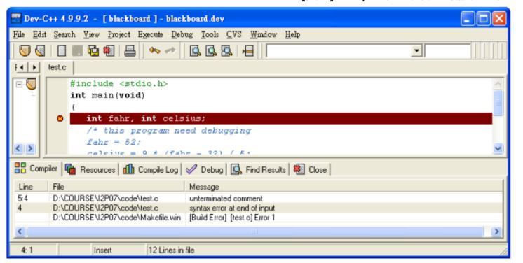

# Debug #
## 程式除錯 ##
通常大家都會把程式裡的錯誤叫做 bug，而找出錯誤的過程就稱為 debugging。程式除錯是一項很重要的技巧，再厲害的
程式設計者也不可能每次都能一次就寫出完全正確的程式，免不了會有些小錯誤或盲點。如果對於除錯很熟練，就可以很
快找出錯誤而把程式寫完，而且可以避免程式在未來的執行過程中當掉。我們用一個錯誤的程式來解釋如何做最基本的除
錯。底下這個程式做的事情是把華氏溫度換算成攝氏溫度，其中斜線符號 / 代表除法運算。
```C=
#include <stdio.h>
int main(void)
(
  int fahr, int celsius;
  /* this program need debugging
  fahr = 52;
  celsius = 9 * (fahr - 32) / 5;
  printf(" %d degrees Fahrenheit = %d degrees Celsius.\n", Fahr)

  return 0;
)
```
程式 compile 之後會出現像下圖的錯誤訊息：

基本上 compiler 會幫你找出 "語法錯誤" (syntax errors)，以上面的例子來說，main() 的定義應該用波浪括號，變數宣告
```int fahr, int celsius; ```應該寫成``` int fahr, celsius; ```
或是

```
int fahr;
int celsius;
```

註解 /* 少了對應的另一邊 */，因此變成沒有結束。再來是 printf() 最後忘了加分號。還有在 printf() 裡面，變數
fahr 打成了 Fahr (大小寫有別)。這些錯誤改了之後，compile 就不再會產生錯誤訊息，能夠順利產生執行檔。

```C
#include <stdio.h>
int main(void)
{
int fahr, celsius;
/* this program need debugging */
fahr = 52;
celsius = 9 * (fahr - 32) / 5;
printf(" %d degrees Fahrenheit = %d degrees Celsius.\n", fahr);

return 0;
}
```
還別高興得太早。在執行了修改過的程式之後，會發現顯示出來的結果怪怪的，出現類似下面的結果


```
52 degrees Fahrenheit = 4009752 degrees Celsius.
```


再看一下程式碼 printf() 的地方，發現原來問題出在 %d 出現了兩次，但是對應的參數只有 fahr。應該還要傳另一個參數 celsius 才符合程式想要顯示的結果。再改成


```
printf(" %d degrees Fahrenheit = %d degrees Celsius.\n", fahr, celsius);
```
結果變成


```
52 degrees Fahrenheit = 36 degrees Celsius.
```


還是有點問題。再仔細檢查一下，原來是公式代錯了，應該是


```
celsius = 5 * (fahr - 32) / 9;
```


修改過後再 compile 並執行，終於可以顯示出想要的結果：


```
52 degrees Fahrenheit = 11 degrees Celsius.
```


整個除錯過程大致就像這樣，逐一把錯誤找出來，重新 compile 看看還有沒有錯誤訊息，如果可以順利 compile，就執行程式檢查輸出結果是否正確。前面提過， compiler 可以幫你檢查語法錯誤，但是當你順利 compile 而得到執行檔，接下來的執行結果的錯誤 compiler 就幫不上忙，因為程式的語法完全正確，只是得到的不是我們要的結果，而 compiler 還沒聰明到能夠理解我們設計這個程式的意圖。像這樣的錯誤稱作 "語意錯誤" (semantic errors) ，平常說話也可能犯類似的錯誤 (譬如："整件事有了三百六十度的轉變")。程式中的語意錯誤通常不是很明顯，這也是除錯最棘手的地方，有時候甚至連執行結果看起來都沒問題，但是卻在執行到了某些特殊狀況才發現程式還是有錯。

我們安裝的程式開發工具除了有 compiler 之外，還會包含除錯器 (debugger)，我們可以用它來找出程式的問題出在哪裡，所以希望大家盡快熟悉如何使用 debugger。我們用底下的例子來示範如何用 debugger 來 trace 程式的進行和變數的狀態。

#### 範例 ####

```C
#include <stdio.h>
int main(void)
{
int m, n;
m = 1;
n = 2;
m = m + n;
n = n + m;
printf(" m = %d, n = %d.\n", m, n);

return 0;
}
```

先用滑鼠在箭頭指的地方按一下，這樣就會做toggle breakpoint 的動作，在那一行程式設定一個中斷點，接著從 Menu 裡選 [Debug]→[Debug]，然後按 Add Watch 把 m 加入觀察名單中，同樣也把 n 加入觀察 (如圖三)。接下來按 [Next Step]就可以單步執行程式，然後觀察變數的值有什麼變化。按 [Next Step] 執行完 m = 1; 這一行之後，可以看到 Watch 視窗裡 m 的值變成 1。執行完 n = 2;之後 n 的值就變成 2。再來執行了 m = m + n; 之後，就會計算出 m + n 是多少，然後把這個值存回 m，所以 m 的值被改成 3。同理當執行完 n = n + m;之後，n 的值變成 5。整個執行的過程，變數的狀態變化可以用圖四來表示。

