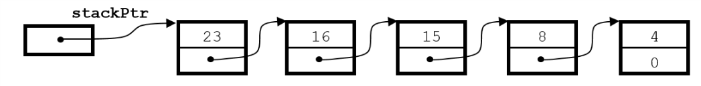
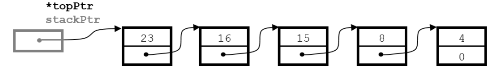
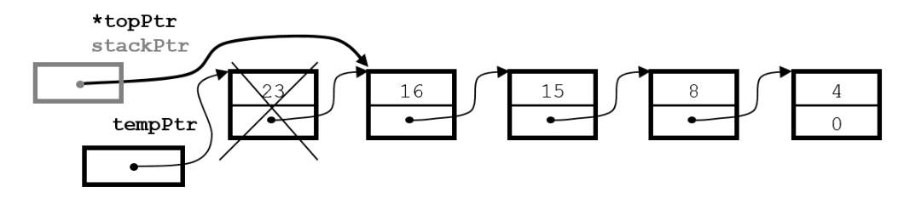
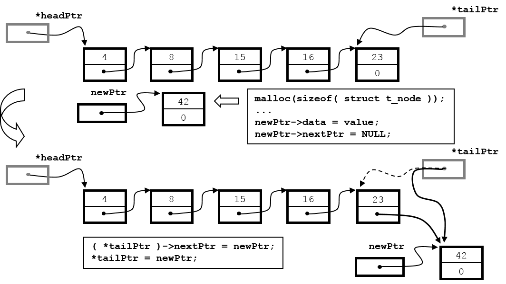
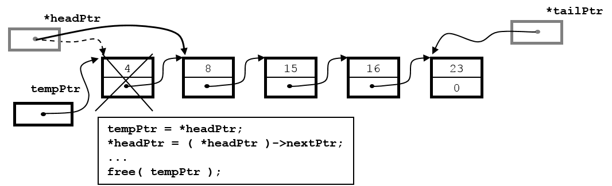
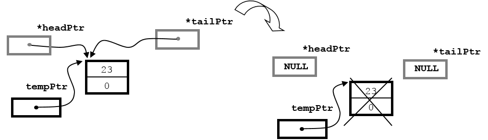
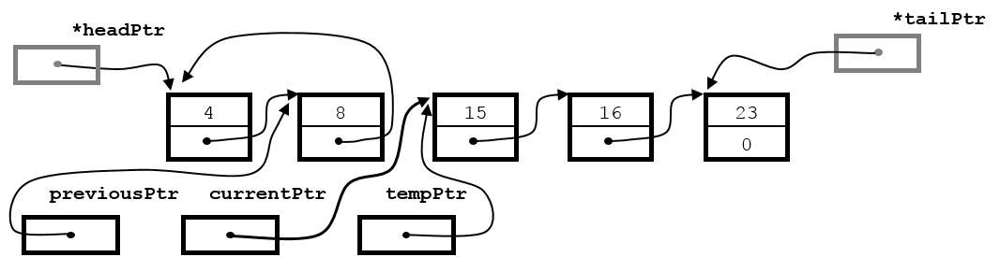

# Week 17

## Unions

除了 structures 之外，C 還提供了 unions，讓我們可以用同一塊區域來儲存不同類型的資料  

```C
union u_tag {
    int ival;
   float fval;
   char *sval;
};
union u_tag u;
```

用這樣方式產生的變數 u 會有剛好足夠的空間來儲存`int`、`float`、`char*`三種型別中最大的型別資料  
變數`u`每次只能儲存三種型別資料中的一種，我們必須自己記得目前`u`所儲存的資料是哪一種型別  
執行程式看看下面的輸出是什麼，就會對`union`的作用更了解  

```C
printf("%d\n", sizeof(u)); /* 4 雖然三個成員各為 4 bytes 但必須共用同一個空間*/
u.ival = 10;                   
printf("%d\n", u.ival);    /* 10 */
u.fval = 20.0;             /* 後來設的值會把前面設的蓋掉 */
printf("%f\n", u.fval);    /* 20.000000 */
printf("%d\n", u.ival);    /* 1101004800 沒有意義 因為浮點數和整數的儲存方式不同*/
u.sval = "abcde";
printf("%d\n", u.ival);    /* 4202504 指標所指到的位址*/
printf("%s\n", u.sval);    /* abcde */
printf("%s\n", u.ival);    /* abcde 位址的儲存方式如果和整數的方式相同就能顯示出字串 */
```

> Note:  
> 在 C 裡面也可以透過`union`來達成 type punning，儘管這有可能是未定義、或是依實作定義的行為  

## C 語言常見誤解

[C 語言常見誤解](https://docs.google.com/document/d/12cR0qb-kl7jB8RA_eHQu8OSmGKEOshwLeX4Mx5qBzUE/edit)

> 然而很多寫 C 的人了解太多實作資訊，誤把特定實作當成 C 語言標準的一部分，寫出許多不可攜 (non-portable) 的程式碼而不自知。  
> 不可攜不代表一定要換一台電腦或是改用嵌入式系統才會錯誤，只要換編譯器或是改變參數，都是一個新的實作；  
> 有很多寫 C 的人常提及開太多最佳化選項容易導致程式錯誤，其實常常只是程式碼本身不可攜罷了 (除非該最佳化故意違反標準)。  
> 同理，可攜程式碼也能一字不動的從 32 位元系統移植至 64 位元系統上 (或是稍早之前，從 16 位元系統移植至 32 位元系統)。  

在這裡提這件事情，並不是說所有程式碼都非得要依照標準才行  
只是有時候有些看起來很炫的寫法，很有可能在某些機器、甚至是在不同版本的編譯器就可能導致出不同後果  
或許有的狀況真的是少之又少，但還是希望大家在輸入程式碼之前，能夠意識到自己的寫法是不是所謂的可攜  

## Stack

看過 linked list 以後，再來就要介紹 stack 這種資料結構  
stack 可以想像將一筆又一筆的資料疊在一起，新加入的資料只能加在 stack 最上層，而且也只能從 stack 最上層移除資料  
這就是所謂的 last-in, first-out (LIFO) 原則  

實作 stack 的其中一種方式，其實和 linked list 一樣，還是利用 structure 和指標  
只是對於 stack 來說，`struct t_node`的 insert 和 delete 只能發生在最前面的 node  
一般習慣將這兩個動作稱作 push 和 pop  

此外，和 linked list 一樣，需要用一個指標指到 stack 的最頂端位址  
而 stack 最底層的 node 的`nextPtr`也要指到`NULL`  

先來看用下面這種`struct t_node`製作出的 stack  

```C
struct t_node {
   int data;
   struct t_node *nextPtr;
};
```


我們需要寫出能達到 push 和 pop 兩種效果的 functions  
有了製作 linked lists 的經驗，這次我們就來看看如何利用指標來寫這兩個 functions  

為了要將 stack 的內容印出來，我們可以直接拿`dispList`來修改，寫出`printStack`  

```C
void printStack(struct t_node *currentPtr)
{ 
   if (currentPtr == NULL) {
      printf("The stack is empty.\n\n");
   }
   else { 
      printf("The stack is:\n");
      while (currentPtr != NULL) { 
         printf("%d --> ", currentPtr->data);
         currentPtr = currentPtr->nextPtr;
      }
      printf("NULL\n\n");
   }
}
```

將新的資料加入 stack 需要`push`這個 function  

```C
void push(struct t_node **topPtr, int val)
{ 
   struct t_node *newPtr; 
   newPtr = (struct t_node *)malloc(sizeof(struct t_node));
   if (newPtr != NULL) {   
      newPtr->data = val;
      newPtr->nextPtr = *topPtr;
      *topPtr = newPtr;
   } else {
      printf("%d not inserted. No memory available.\n", val);
   }
}
```

參數`topPtr`出現兩個星號是因為我們想要「更改指標所指向的位址」的效果  
在`main`裡，假設有一個指標指向 stack 的最上層位址  
接著把`stackPtr`這個指標變數本身的位址傳給`push`  

```C
struct t_node *stackPtr = NULL;
push(&stackPtr, 42);
```

由於`stackPtr`已經是`struct t_node*`，所以`&stackPtr`的型別就是`struct t_node**`  
如此一來，在`push`裡面對`topPtr`所做的修改，才能夠真的影響到`main`裡的`stackPtr`  

假設我們已經用了一連串`push`產生了下面的 stack (想想看是依照什麼順序呼叫`push`得到這樣的結果)  



在這樣的情況下，再寫出`push(&stackPtr, 42);`  
進入`push`的內部以後，應該會有如下圖所表示的狀況  


`topPtr`這個指標所記錄的位址是`&stackPtr`，所以`*topPtr`相當於`stackPtr`  
記錄的是由`struct t_node`組成的 stack 的起始位址  


而將頂端的資料從 stack 移除需要`pop`這個 function  
使用雙重指標的理由同上，都是為了要直接能改更改外面指標所儲存的位址  

```C
int pop(struct t_node **topPtr)
{ 
   struct t_node *tempPtr; 
   int popValue; 
   if (*topPtr == NULL) return -1;
   tempPtr = *topPtr;
   popValue = (*topPtr)->data;
   *topPtr = (*topPtr)->nextPtr;
   free(tempPtr);
   return popValue;
}
```

假設我們已經用了一連串`push`產生了下面的 stack  


在這樣的情況下，再寫出`pop(&stackPtr);`  
進入`pop`的內部以後，應該會有如下圖所表示的狀況  



執行`pop`應該要傳回 23 這個整數，然後`stackPtr`要指到儲存 16 的`struct t_node`
再把原本儲存 23 的`struct t_node`所佔用的空間釋放掉。



最後是完整的程式碼  

```C
#include <stdio.h>
#include <stdlib.h>

struct t_node {
   int data;
   struct t_node *nextPtr;
};

void printStack(struct t_node *currentPtr)
{ 
   if (currentPtr == NULL) {
      printf("The stack is empty.\n\n");
   }
   else { 
      printf("The stack is:\n");
      while (currentPtr != NULL) { 
         printf("%d --> ", currentPtr->data);
         currentPtr = currentPtr->nextPtr;
      }
      printf("NULL\n\n");
   }
}

void push(struct t_node **topPtr, int val)
{ 
   struct t_node *newPtr; 
   newPtr = (struct t_node *)malloc(sizeof(struct t_node));
   if (newPtr != NULL) {   
      newPtr->data = val;
      newPtr->nextPtr = *topPtr;
      *topPtr = newPtr;
   } else {
      printf("%d not inserted. No memory available.\n", val);
   }
}

int pop(struct t_node **topPtr)
{ 
   struct t_node *tempPtr; 
   int popValue; 
   if (*topPtr == NULL) return -1;
   tempPtr = *topPtr;
   popValue = (*topPtr)->data;
   *topPtr = (*topPtr)->nextPtr;
   free(tempPtr);
   return popValue;
}

int main()
{   
   struct t_node *stackPtr = NULL;
   int i;
   push(&stackPtr, 4);
   push(&stackPtr, 8);
   push(&stackPtr, 15);
   push(&stackPtr, 16);
   push(&stackPtr, 23);
   printStack(stackPtr);
   i = pop(&stackPtr);
   printStack(stackPtr);
   printf("%d is popped.\n", i);   

   return 0;   
}
```

## Queue

queue 的操作原則是 first-in, first-out (FIFO)，也就是最常在生活中看到的排隊原則  
先排隊的先結帳，後來加入的要排在隊伍最後面  


實作 queue 的其中一種方式是利用 linked list 的來儲存資料  
相對於 stack 的 push 和 pop，queue 需要 enqueue 和 dequeue 這兩個操作  

首先是`printQueue`，寫法和`printStack`完全一樣，在此便不贅述  

```C
void printQueue(struct t_node *currentPtr)
{ 
   if (currentPtr == NULL) {
      printf("The queue is empty.\n\n");
   }
   else { 
      printf("The queue is:\n");
      while (currentPtr != NULL) { 
         printf("%d --> ", currentPtr->data);
         currentPtr = currentPtr->nextPtr;
      }
      printf("NULL\n\n");
   }
}
```

再來是`enqueue`，由於 stack 不論加入或移除都是從 stack 的最上端進行操作，但是 queue 則是從末端加入、前端移除  
所以 queue 除了要有一個`head`指標指到 queue 的前端以外，還需要`tail`指標指到 queue 的末端  
其中要注意比較特別的狀況是一開始 queue 一個元素都沒有的時候，該怎麼處理`headPtr`跟`tailPtr`  

```C
void enqueue(struct t_node **headPtr, struct t_node **tailPtr, int val)
{ 
   struct t_node *newPtr; 
   newPtr = (struct t_node *)malloc(sizeof( struct t_node ));
   if (newPtr != NULL) {
      newPtr->data = val;
      newPtr->nextPtr = NULL;
      if (*headPtr == NULL) {   /* 假如 queue 還是空的, 則在第一個 node 被加入之後, */
         *headPtr = newPtr;     /* headPtr 和 tailPtr 會暫時都指向第一個 node     */
      } else {
         (*tailPtr)->nextPtr = newPtr;
      }
      *tailPtr = newPtr;
   } else {
      printf("%c not inserted. No memory available.\n", val);
   }
}
```

假設我們已經用了一連串`enqueue`產生了下面的 queue  


在這樣的情況下，再寫出`enqueue(&head, &tail, 42);`  
進入`enqueue`的內部以後，應該會有如下圖所表示的狀況  



接著是`dequeue`的部分，這個 function 負責把`head`指標從第一個 node 移到第二個 node，然後把第一個 node 的空間釋放  
同樣地，因為`head`指標一旦移動到第二個 node，第一個 node 的位址就沒有人記得  
所以要先用`tempPtr`把第一個 node 的位址先記住，才能移動`head`指標  

```C
int dequeue(struct t_node **headPtr, struct t_node **tailPtr)
{ 
   int val; 
   struct t_node *tempPtr; 
   if (*headPtr == NULL) return -1;
   val = (*headPtr)->data;
   tempPtr = *headPtr;
   *headPtr = (*headPtr)->nextPtr;

   if (*headPtr == NULL) {
      *tailPtr = NULL;
   }
   free(tempPtr);
   return val;
}
```

假設我們已經用了一連串`enqueue`產生了下面的 queue  


在這樣的情況下，再寫出`dequeue(&head, &tail);`  
進入`dequeue`的內部以後，應該會有如下圖所表示的狀況  



一樣要注意的是，當只剩下一個 node 的時候，`(*headPtr)->nextPtr`指到`NULL`  
所以執行`*headPtr = (*headPtr)->nextPtr;`之後，`*headPtr`指向`NULL`  
在這種情況下`*tailPtr`也應該指到`NULL`，回到 empty queue 的狀態  



最後是完整的程式碼  

```C
#include <stdio.h>
#include <stdlib.h>

struct t_node {
   int data;
   struct t_node *nextPtr;
};

void printQueue(struct t_node *currentPtr)
{ 
   if (currentPtr == NULL) {
      printf("The queue is empty.\n\n");
   }
   else { 
      printf("The queue is:\n");
      while (currentPtr != NULL) { 
         printf("%d --> ", currentPtr->data);
         currentPtr = currentPtr->nextPtr;
      }
      printf("NULL\n\n");
   }
}

void enqueue(struct t_node **headPtr, struct t_node **tailPtr, int val)
{ 
   struct t_node *newPtr; 
   newPtr = (struct t_node *)malloc(sizeof( struct t_node ));
   if (newPtr != NULL) {
      newPtr->data = val;
      newPtr->nextPtr = NULL;
      if (*headPtr == NULL) {   /* 假如 queue 還是空的, 則在第一個 node 被加入之後, */
         *headPtr = newPtr;     /* headPtr 和 tailPtr 會暫時都指向第一個 node     */
      } else {
         (*tailPtr)->nextPtr = newPtr;
      }
      *tailPtr = newPtr;
   } else {
      printf("%c not inserted. No memory available.\n", val);
   }
}

int dequeue(struct t_node * *headPtr, struct t_node * *tailPtr)
{ 
   int val; 
   struct t_node *tempPtr; 
   if (*headPtr == NULL) return -1;
   val = (*headPtr)->data;
   tempPtr = *headPtr;
   *headPtr = (*headPtr)->nextPtr;

   if (*headPtr == NULL) {
      *tailPtr = NULL;
   }
   free(tempPtr);
   return val;
}

int main()
{   
   struct t_node *head = NULL;
   struct t_node *tail = NULL;
   int i;
   enqueue(&head, &tail, 4);
   enqueue(&head, &tail, 8);
   enqueue(&head, &tail, 15);
   enqueue(&head, &tail, 16);
   enqueue(&head, &tail, 23);
   enqueue(&head, &tail, 42);
   printQueue(head);
   i = dequeue(&head, &tail);
   printQueue(head);
   printf("%d is popped.\n", i);   

   return 0;   
}
```

再來是有點挑戰的部分，我們能不能寫出一個 function 使得整個 queue 的順序倒過來？  
譬如原本的內容是`1 -> 2 -> 3`，經過`reverse`以後就會變成`3 -> 2 -> 1`  

```C
void reverse(struct t_node **headPtr, struct t_node **tailPtr)
{
   struct t_node *currentPtr;
   struct t_node *previousPtr;
   struct t_node *tempPtr;     
 
   if (*headPtr != *tailPtr) { /* 如果 queue 只剩一個 node, 或是 queue 是空的, 
                                則 *headPtr 和 *tailPtr 會相等, 這時候並不需要做任何動作 */
      previousPtr = *headPtr;
      currentPtr = previousPtr->nextPtr; /* previousPtr、currentPtr 指到相鄰 nodes */

      while(currentPtr != *tailPtr) {
         tempPtr = currentPtr->nextPtr;     /* 先記住下一個 node 的位址           */
         currentPtr->nextPtr = previousPtr; /* 記住後更改指標 讓牠往回指           */
         previousPtr = currentPtr;          /* previousPtr 往下移動一個 node     */
         currentPtr = tempPtr;              /* currentPtr 也往下移到剛才記住的位址 */
      }
      (*tailPtr)->nextPtr = previousPtr;  /* 迴圈結束後還要再收尾
                                               把原本指到 null 的指標改指到前一個 node */ 
      tempPtr = *tailPtr;  /* swap 三步驟又來了 */
      *tailPtr = *headPtr;
      *headPtr = tempPtr;    
  
      (*tailPtr)->nextPtr = NULL; /* 把新的 *tailPtr 的 nextPtr 指到 NULL */
   }
}
```





## Binary Search Tree

終於要介紹 tree 這種有趣的資料結構，以後學 data structure 和 algorithm 的時候會遇到各式各樣奇怪的樹  
在這裡我們只簡單介紹 binary search tree (二元搜尋樹)，從名字可看出 binary search tree 其實是 binary tree 的一種特例  

所謂 binary tree 是指每個 node 最多可以有兩個指標指向別的 nodes  
我們必須稍微修改下`struct t_node`的內容  

```C
struct t_treeNode {
   struct t_treeNode *leftPtr;
   int data;
   struct t_treeNode *rightPtr;
};
```

所以 binary tree 的每個節點都長得像`struct t_treeNode`這樣的結構  
也就是除了有`data`欄位儲存資料之外，還包含了兩個指向`struct t_treeNode`的指標  

在開始寫程式產生 binary search tree 之前，先來看一個實際例子，並且了解一下定義  


1.  最上面的那個 node 稱作 root；root 只會指別人，不會被別人指。

2.  最下面的那些 node 稱作 leaf nodes；leaf nodes 只會被指，不會指別人

3.  相連的 nodes 之間的關係: 指別人的稱作 parent，被別人指的稱作 child。

4.  每個 node 左右兩邊連著的，通常被稱作 left subtree 左子樹和 right subtree 右子樹。

5.  binary search trees 的特性是對任意一個 node 來說
    *   所有左子樹的每個 node 的值都比它小
    *   而所有左子樹的每個 node 的值都比它大

而走訪一個 binary search tree 的每一個 node 有三種方式  


1.  **preorder** (中間節點 -> 左子樹 -> 右子樹)  
    27 13 6 17 42 33 48  

2.  **inorder** (左子樹 -> 中間節點 -> 右子樹)  
    6 13 17 27 33 42 48  

3.  **postorder** (左子樹 -> 右子樹 -> 中間節點)  
    6 17 13 33 48 42 27  

```C
#include <stdio.h>
#include <stdlib.h>

struct t_treeNode { 
   struct t_treeNode *leftPtr;  /* 指向左子樹 (記錄左子樹的 root 的位址) */
   int data; 
   struct t_treeNode *rightPtr; /* 指向右子樹 (記錄右子樹的 root 的位址) */
}; 
typedef struct t_treeNode  TreeNode; /* 為了方便 替 struct t_treeNode 取個新名字 */
typedef TreeNode *    TreeNodePtr;   /* 替 TreeNode* 也取一個新名字，可以避免使用兩個星號 */

void insertNode(TreeNodePtr *treePtr, int value); /* 參數使用 call-by-reference */
void inOrder(TreeNodePtr treePtr);
void preOrder(TreeNodePtr treePtr);
void postOrder(TreeNodePtr treePtr);

int main( void )
{ 
   TreeNodePtr rootPtr = NULL; 

   insertNode(&rootPtr, 27);
   insertNode(&rootPtr, 42);
   insertNode(&rootPtr, 13);
   insertNode(&rootPtr, 6);
   insertNode(&rootPtr, 33);
   insertNode(&rootPtr, 48);
   insertNode(&rootPtr, 17);

   printf("\n\nThe preOrder traversal is:\n");
   preOrder(rootPtr);
   printf("\n\nThe inOrder traversal is:\n");
   inOrder(rootPtr);
   printf("\n\nThe postOrder traversal is:\n");
   postOrder(rootPtr);
   return 0; 
}

/* 用 recursive 方式加入新的 node */
void insertNode(TreeNodePtr *treePtr, int value)
{   
   if (*treePtr == NULL) { /* *treePtr 記錄的位址是 NULL */  
      *treePtr = (TreeNodePtr)malloc(sizeof( TreeNode ));
      if (*treePtr != NULL) { 
         (*treePtr)->data = value;
         (*treePtr)->leftPtr = NULL;
         (*treePtr)->rightPtr = NULL;
      }
      else {
         printf("%d not inserted. No memory available.\n", value);
      }
   } else {
      if (value < (*treePtr)->data) {
         insertNode(&((*treePtr)->leftPtr), value);
      }  else if (value > (*treePtr)->data) {
         insertNode(&((*treePtr)->rightPtr), value);
      }
      else { /* 如果要放入的值重複 (已經在 tree 裡面) 就不再放入 */
         printf("重複");
      }
   } 
}

/* 用 recursive 方式走完一個 tree */
void inOrder(TreeNodePtr treePtr)
{ 
   if (treePtr != NULL) { 
      inOrder(treePtr->leftPtr);
      printf("%3d", treePtr->data);
      inOrder(treePtr->rightPtr);
   } 
} 

void preOrder(TreeNodePtr treePtr)
{ 
   if (treePtr != NULL) { 
      printf("%3d", treePtr->data);
      preOrder(treePtr->leftPtr);
      preOrder(treePtr->rightPtr);
   }
} 

void postOrder(TreeNodePtr treePtr)
{ 
   if (treePtr != NULL) { 
      postOrder(treePtr->leftPtr);
      postOrder(treePtr->rightPtr);
      printf("%3d", treePtr->data);
   }
} 
```

---

# 練習題

## Stack-01

把`printStack`用 recursive 的方式改寫  

## Stack-02

使用 stack 判斷一個字串的括號是否正確對應  
可以將`(`都放到 stack 裡面，遇到`)`就檢查 stack 能不能 pop 出一個`(`

```
( ( ( ) ( ) ) ( ) )
```

## Binary Search Tree-01

前面介紹的 binary search tree 不允許重複的值出現，也就是保證每個 node 存放的值都不一樣  
如果要把它改成可以允許重複的值，可以在`struct t_treeNode` 多加一個欄位來記錄重複的次數  
但是這樣做會多佔用一些空間，可以想想看有沒有其他作法  

## Binary Search Tree-02

寫一個 function 名為`deleteNode`，可以傳入某個值，把存放這個值的 node 刪除  
關鍵在如何把斷掉的樹接起來  

```C
int deleteNode(TreeNodePtr *treePtr, int value);
```


