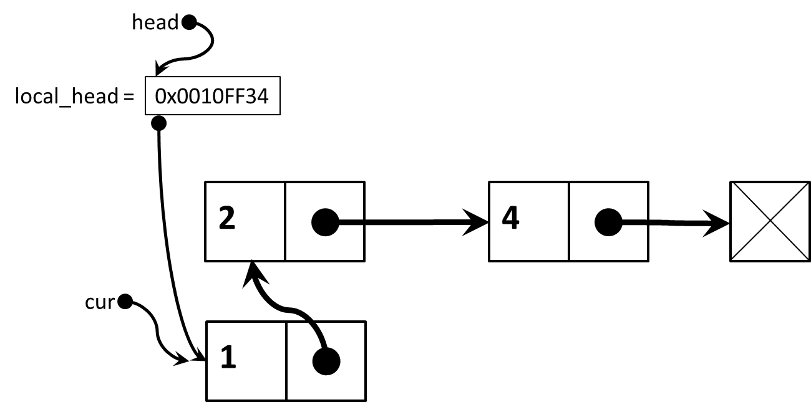
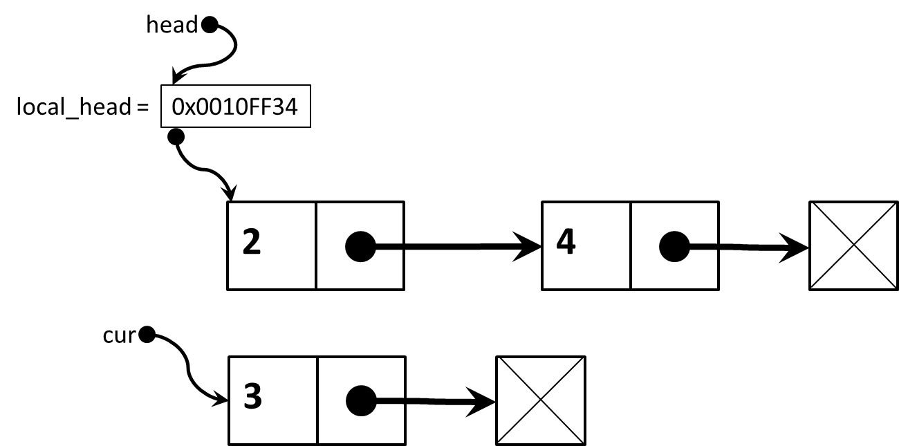
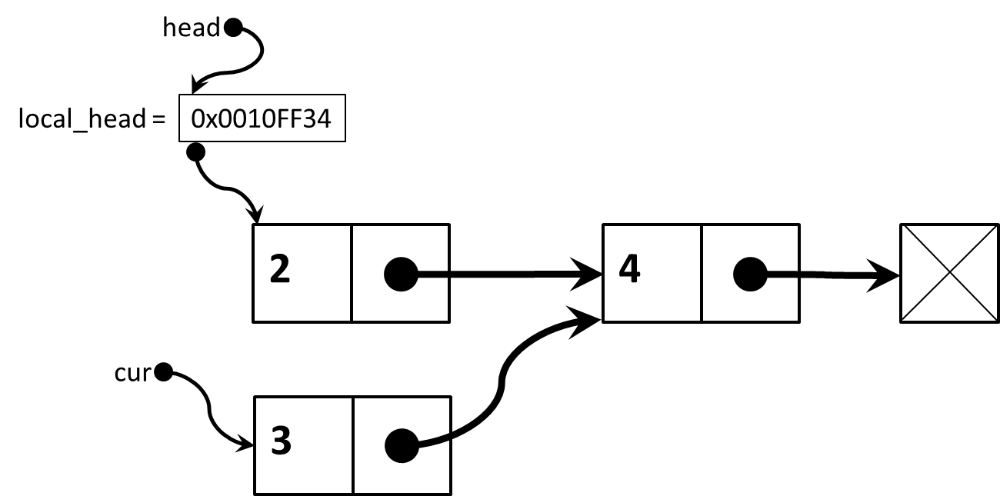
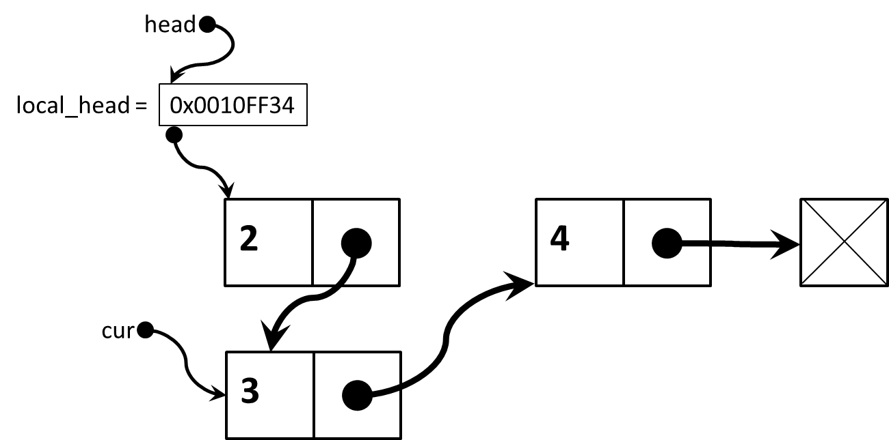
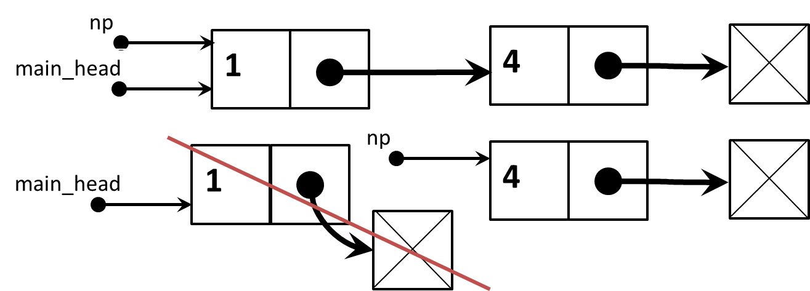
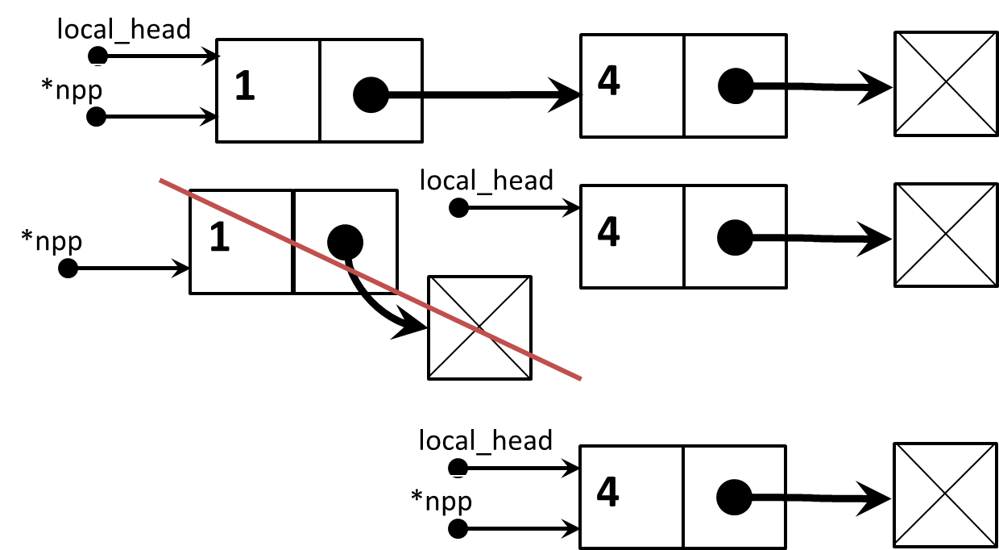

##與作業有關的 linked lists 補充說明

作業的 linked lists 實作方式和上課講的作法稍微不同，所以我們再補充說明一下。
上課講的例子，都會把更改過後的 list 的開頭位址用 `return` 的方式傳回到 `main`，例如 `head = removeFirst(head);`，但是在作業的範例程式，則是透過參數，傳遞某個指標變數的位址，以便修改函數外部的指標變數。

作業的範例程式碼，linked list 的基本單位是 `Node`

	typedef struct _Node {
		int data;
		struct _Node *next;
	} Node;

需要實作的函數是

	void insert_increase_list(Node**, int);

第一個參數有兩個星號，表示傳入的資訊是某個指標變數的位址。乍看之下有點奇怪，但其實很合理。指標變數的作用是記住某個記憶體位址，但是既然指標變數也是一個變數，自己也會占據記憶體的某塊空間，因此指標變數也會有位址。假設某個指標變數的型別是 `int *` (指向整數的指標)，這個指標變數的位址的型別就會是 `int * *`。


再針對這個例子說明一次:
之所以需要傳入指標變數的位址，是為了修改函數外部某個指標的值，這件事必須透過位址，才能找到那個外部的變數。回想上學期 `swap(a,b)` 的例子，假如有兩個 `int` 變數 `a` 和 `b`，希望透過呼叫 `swap` 將兩的變數的內容交換，正確的寫法應該是，`swap(&a,&b)` 將 `a` 和 `b` 的位址告訴 `swap`，所以 `swap` 的參數型態應該是 `swap(int *, int *)`，才能夠接收傳入的位址。

對於作業的例子來說，由於 `main` 裡面的變數 `head` 自己已經是指標變數，它的型別是 `Node *head`，而 `insert_increase_list` 使用的時候像底下這樣

	insert_increase_list(&head, data);

傳入的是 `&head`，也就是變數 `head` 的位址，因此對應的參數型別應該是 `Node* *`，這樣才符合 `&head` 的型別，也才能正確接收傳入的資訊--指標變數的位址。

#####這題該怎麼寫?
建議先做底下的設定

	void insert_increase_list(Node** hp, int data)
	{
		Node *local_head;
	    local_head = *hp;
	    
	    // 其他程式碼
	    
	    *hp = local_head;
	}

先宣告一個函數內的局部指標變數 `Node *local_head`。然後從傳入的參數 `hp`(也是個指標變數) 所記住的位址，找到該位址裡面所存放的數值，也就是取出 `*hp`，這件事通常簡稱為 "取出 `hp` 所"指到"的值"。而`*hp`的值，其實也是某個記憶體位址，也就是 `main` 裡面保存的某個 linked list 的開頭位址。因此 `local_head = *hp;` 就是為了把外面傳入的 linked list 開頭位址，設定給 `head`，這樣我們對 linked list 做一些我們想要的操作和更改。
函數呼叫的最後，則要做 `*hp = local_head;`，因為做完 insert 可能會動到 linked list 的開頭，所以要把更新之後的 `local_head`，存回 `*hp`，這樣 `main` 裡面的 `head` 才會被更改。

中間那段 `// 其他程式碼` 是這次作業的重點，請自己設法寫出來。

*基本想法:*

1. 如果 `local_head` 是 `NULL` 表示 list 是空的，這時候應該要用 `malloc` 造出一個新的 `Node`，構成一個只有單一 `Node` 的新 list。
2. 如果 `local_head` 所指到的 list 已經有東西，就要設法循序查看 list，找到安插 `data` 的地方。這裡會有兩種情況需要考慮。
   2.1 如果要安插的地方剛在 list 的最開頭，也就是傳入的 `data` 比 list 裡既有的數值都還小，所以要排在最前面。這時候應該要用 `malloc` 產生新的 `Node`，然後把原有的 list 接在這個 `Node` 的後面，並且把 `local_head` 改只到新的 `Node`。
   2.2 如果要安插的地方是在 list 的其他地方，這時候做法比較簡單，只要設法把 list 串起來就行了， `local_head` 不需要改變。但是有一個小細節要注意，不能只記住目前正在比較大小的 `Node`，還要記住前一個 `Node` 在哪裡，才能有串得起來。


*上述 2.1 的情況如下*
原本是

變成



*上述 2.2 的情況如下*
原本是

變成

然後是


---

#####再用圖例來比較一個星號和兩個星號兩種寫法的差異

如果 `deleteNode` 的參數的 type 是 `Node*`
使用方式可能像底下的程式寫法

	int main(void)
	{
		Node *main_head;
		...
		deleteNode(main_head, 1);
		...
	}
	...
	void deleteNode(Node * np, int idx)
	{
		...
	    np = ...
	}



呼叫的時候傳入的是指標 `main_head`，而指標變數`main_head`的值是記憶體位址，在這個例子裏是 list 的第一個`Node`的位址，假設是`0X10FF3040`。呼叫之後進入`deleteNode(Node *np)`，所以`np`會取得`0X10FF3040`這個值，意義上就是`np`和`main_head`指向同一個`Node`位址。假設移除了第一個`Node`，所以`np`會被更新，變成指向下一個`Node`，不過`main_head`並不會被更改。而且如果原本的第一個`Node`已經被`free`，指標變數`main_head`的值`0X10FF3040`已經變成了一個不合法的記憶體位址。所以，整個程式會出錯。
為了讓`main_head`可以得到正確的值，第一種改寫方式是

	int main(void)
	{
		Node *main_head;
		...
		main_head = deleteNode(main_head, 1);
		...
	}
	...
	Node* deleteNode(Node * np, int idx)
	{
		...
	    np = ...
	    ...
	    return np;
	}
`deleteNode`必須傳回更新之後的位址，然後在`main`裡面要接收傳回來的值。
​    
另一種改寫方式則是用兩個星號，在`main`裡面，呼叫`deleteNode`的時候傳入的是`&main_head`，也就是`main_head`的位址 (type 會是 `Node**`)。

	int main(void)
	{
		Node *main_head;
		...
		deleteNode(&main_head, 1);
		...
	}
	...
	void deleteNode(Node ** npp, int idx)
	{
		Node *local_head;
	    local_head = *npp;
	    ...
	    local_head = ...
	    ...
	    *npp = local_head;
	}




***
#####再一個關於兩個星號的練習

變數宣告的時候
只要有星號
就表示是指標變數

假設 `Node * p;`
因此 `p` 是一個指標變數，可以用來記住某個 type 是 `Node`的東西的位址
例如 `p = (Node*) malloc(sizeof(Node));`

至於 `Node * * pp;`
`pp` 也是指標變數，可以用來記住某個 type 是 `(Node *)` 的東西的位址
例如 `pp = &p;`
`p` 的 type 是 `Node*`
所以 `&p` 的 type 是 `(Node *) *`
剛好和 `pp` 的 type 一樣
所以可以做 `pp = &p;`
用 `pp` 去記住 `p` 的位址

	#include <stdio.h>
	#include <stdlib.h>
	#include <string.h>
	
	typedef struct {
		int data;
		char str[10];
	} Node;
	
	void print(Node *p)
	{
		printf("%s= %d\n", p->str, p->data);
	}
	
	void swap1(Node *p, Node *q)
	{
		Node *tmp;
		tmp = p;
		p = q;
		q = tmp;
	}
	
	void swap2(Node **pp, Node **qq)
	{
		Node *tmp;
		tmp = *pp;
		*pp = *qq;
		*qq = tmp;
	}
	
	int main(void)
	{
		Node *x, *y;
	
		x = (Node*) malloc(sizeof(Node));
		x->data = 100;
		strcpy(x->str, "Alice");
	
		y = (Node*) malloc(sizeof(Node));
		y->data = 200;
		strcpy(y->str, "Bob");
	
	    printf("Original\n");
		print(x);
		print(y);
	
		printf("\nAfter swap1\n");
		swap1(x, y);
		print(x);
		print(y);
	
		printf("\nAfter swap2\n");
		swap2(&x, &y);
		print(x);
		print(y);
	
		return 0;
	}

----

`swap2` 也可以用比較冗長的方式來寫
中間那三行跟 `swap1` 一模一樣

	void swap2(Node **pp, Node **qq)
	{
		Node *tmp, *p, *q;
		p = *pp;
		q = *qq;
	
		tmp = p;
		p = q;
		q = tmp;
	
		*pp = p;
		*qq = q;
	}

​    


Linus Torvalds on understanding pointers

範例：https://grisha.org/blog/2013/04/02/linus-on-understanding-pointers/


底下的程式碼節錄至 Grisha Trubetskoy 的部落格


```
typedef struct list_entry {
    int val;
    struct list_entry *next;
} list_entry;
```


"Bad taste"

```
list_entry *entry = head; /* assuming head exists and is the first entry of the list */
list_entry *prev = NULL;

while (entry) {
    if (entry->val == to_remove)     /* this is the one to remove */
        if (prev)
           prev->next = entry->next; /* remove the entry */
        else
            head = entry->next;      /* special case - first entry */

    /* move on to the next entry */
    prev = entry;
    entry = entry->next;
}
```


"Good taste"

```
list_entry **pp = &head; /* pointer to a pointer */
list_entry *entry = head;

while (entry) {
    if (entry->val == to_remove)
        *pp = entry->next;

    pp = &entry->next;
    entry = entry->next;
}
```