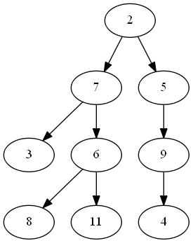

# Binary Tree

在圖論中，[**Binary Tree**](http://www.csie.ntnu.edu.tw/~u91029/BinaryTree.html) 是一種特殊建構的樹 ([**Tree**](http://www.csie.ntnu.edu.tw/~u91029/Tree.html)) ，每個節點 (**node**) 最多只會延伸出兩個節點。對於從任意 V 節點延伸出去的節點 V'，V' 就是 V 的 **child**，V 就是 V' 的 **parent**。在 Binary tree 中最上層的節點稱為**根 (root)**。如果一個節點沒有延伸出任何點，則這個點被稱為 **leaf** 。值得一提的是：對於任意一個節點 V ， V 與其底下延伸出的所有點，也能建構出一個 binary tree ，這個比較小的 tree 就是原本 binary tree 的一個**子樹 (subtree)**。

以下圖為例， root 裡存的數字就是`2`；`3`、`8`、`11`、`4`是 leaf 。對於`7`這個節點，`3`與`6`分別是`7`的 left child 與 right child ，`2`是`7`的 parent ；對於`7`這個節點，所有從`7`底下延伸出的節點(`3`、`6`、`8`、`11`)，與`7`這個節點也能構成一個 binary tree ，這棵 tree 是`2`這個節點的 left subtree ，而`5`、`9`、`4`這三個點則構成`2`的 right subtree。



如果我們採用某種規則，依照一定的順序走過每個`Node`，會得到一個序列。

### in-order (left subtree, root, right subtree)

譬如，從 root 開始，如果我們每次都先走左邊的分支，然後一路向下，直到左邊的分支的全部的`Node`都被走過，接著才走中間的 2，然後才繼續將右邊分支全走過，這樣得到的序列順序稱作 in-order，得到的序列會像底下這樣：
```
3 7 8 6 11 2 5 9 4
```
由遞迴的觀點來看，問題可以拆解成：

> 1. 用 in-order 方式走過左邊以`7`為 root 的分支 (left subtree)
> 2. 走過 root `2`
> 3. 用 in-order 方式走過右邊以`5`為 root 的分支 (right subtree)

接下來，以`7`為 root 的分支，如果要繼續用 in-order 方式走過，一樣是：

> 1. 用 in-order 方式走過左邊以`3`為 root 的分支 (left subtree)
> 2. 走過 root `7`
> 3. 用 in-order 方式走過右邊以`6`為 root 的分支 (right subtree)

如此不斷進行下去，直到碰到某個 leaf ，就不用再繼續下去。以這個例子來說，最早被走到的 leaf 是`3`。由於把 binary tree 上任意一點當成 root ，都能建構出一個新的 binary tree ，我們才以遞迴解決此問題，也能確保在樹上的所有點都有被走到。

總之，只要每次都遵守 ***左 中 右*** 的原則，全部左邊的分支都走過，才可以走中間，然後才可以走右邊分支，如此就可以列出 in-order 的序列。

### pre-order (root, left subtree, right subtree)
每次都是先走中間的`Node`，然後才把左邊的分支整個走過，接著才將右邊的分支整個走過。得到的序列會像底下這樣：
```
2 7 3 6 8 11 5 9 4
```
### post-order (left subtree, right subtree, root)
每次都是先把左邊的分支整個走過，然後才將右邊的分支整個走過，接著才走中間的`Node`。得到的序列會像底下這樣：
```
3 8 11 6 7 4 9 5 2
```

### 從 pre-order 和 in-order 建構出 binary tree
前面已經看過，對於任一個 binary tree，我們可以列出 in-order 和 pre-order 序列。如果是反過來呢？ 假設已知 in-order 序列，或是已知 pre-order 序列，能否決定 binary tree 的長相？ 
事實上，如果只知道 in-order 或 pre-order，並無法決定唯一可能的 binary tree 結構。但是如果同時給了 in-order 和 pre-order 序列，而且每個`Node`編號 (或是資料) 都不相同，則一定可以決定出唯一的 binary tree 該長成甚麼樣子。我們試著寫程式來完成這項任務。

首先要讀取 pre-order 和 in-order 序列。從 pre-order 的第一個數，可以知道如何將 in-order 序列分成左右兩段。例如：

```
pre-order: 2 7 3 6 8 11 5 9 4
in-order : 3 7 8 6 11 2 5 9 4
```

我們知道 pre-order 的第一個數`2`就是 root。接著就可以把 in-order 序列以`2`為分隔點，分成`3 7 8 6 11`以及`5 9 4`兩段。

```
pre-order:   7 3 6 8 11 5 9 4
in-order left : 3 7 8 6 11
in-order right: 5 9 4
```

先從左邊開始，所以接下來的問題會變成：

```
pre-order: 7 3 6 8 11 5 9 4
in-order : 3 7 8 6 11
```

然後從 pre-oreder 的第一個數`7`，我們知道要把 in-order 序列分成`3`和`8 6 11`

```
pre-order:   3 6 8 11 5 9 4
in-order left : 3
in-order right: 8 6 11
```

繼續走左邊，問題變成：

```
pre-order: 3 6 8 11 5 9 4
in-order : 3
```

這時候就可以建出一個 leaf `Node`，裡面放的數字是`3`。然後，回到上一層，處理右邊
```
pre-order: 6 8 11 5 9 4
in-order : 8 6 11
```
這時候 pre-order 第一個數是`6`，分兩段變成
```
pre-order:   8 11 5 9 4
in-order left : 8
in-order right: 11
```
如此繼續做下去，最終我們可以把 pre-order 和 in-order 的每個數都看過一遍，而且可以依照對應的順序，把 binary tree 建構起來。

值得一提的是，如果給定 in-order 與 post-order 序列，我們也能建出唯一的 binary tree ，但是如果給定 post-order 與 pre-order 序列，我們卻無法建出一棵 binary tree，因為是我們無法確定 root 的位置，所以沒辦法像上面一樣把序列切成 left subtree 跟 right subtree。


## 寫程式

### 先定好 binary tree 所需的基本資料結構
```C
typedef struct t_node
{
    int data;
    struct t_node *left, *right;
} Node;
```
每個`Node`裡面放的是整數。接下來就可以寫函數`newNode`，用來產生一個新的`Node`。
```C
Node* newNode(int val)
{
    Node *node = (Node *) malloc(sizeof(Node));
    node->data = val;
    node->left = node->right = NULL;
    return node;
}
```

接下來先看`main`裡面需要做哪些事
```C
int main(void)
{
    int *in, *pre, n, i;
    scanf("%d", &n); // get the size of tree
    in = (int *) malloc(n * sizeof(int)); //allocate space for inorder
    pre = (int *) malloc(n * sizeof(int)); // allocate space for preorder
    
    for(i=0; i<n; i++) // read in inorder
        scanf("%d", &in[i]);
    
    for(i=0; i<n; i++) // read in pre-order
        scanf("%d", &pre[i]);
    
    Node *root = constructTree(in, pre, 0, n-1); // construct trr
    printf("%d\n", maxValue(root)); // print the max value of the tree

    writeGV(root);

    inorder(root);
    printf("\n");
    postorder(root);

    destroyTree(root);// clean up
    free(in);
    free(pre);

    return 0;
}
```
對照註解的說明，首先是讀取序列的長度`n`，然後分別用`malloc`動態地產生兩個整數陣列`in`和`pre`，用來存放 in-order 和 pre-order 序列。

接下來則是呼叫`constructTree(in, pre, 0, n-1)`函數，提供`in`和`pre`兩個陣列，以及陣列的開頭和最後的元素編號 (index)，用遞迴方式將 binary tree 建構出來。

有了 binary tree 之後，就可以呼叫`maxValue(root)`把 binary tree 的 root 傳入，然後找出整個 binary tree 裡面最大的值是多少。

上述的`constructTree`和`maxValue`函數，都要自己練習實作。另外我們也要寫出`writeGV`函數，用來輸出 binary tree 的描述檔，之後可以用 Graphviz 工具，將描述檔轉成 png 圖檔，就可以看到視覺化後的 binary tree 圖形，這份講義的最前面的圖案就是用這個方式產生。

接著呼叫`inorder(root)`和`postorder(root)`，反過來從 binary tree 生成， in-order 和 post-order 序列。其中，post-order 序列顧名思義，是以 *左 右 中* 的順序，將 binary tree 走完，用同樣的例子來說明，post-order 序列會是
```
3 8 11 6 7   4 9 5   2
```

程式最後要呼叫`destroyTree(root)`把 binary tree 砍掉，而且也要呼叫`free`，把當初用`malloc`產生的`in`和`pre`兩個陣列。

底下我們就一一檢視上述需要用到的函數。

### 從 in-order 和 pre-order 序列長出 binary tree
```C
// 傳入 preorder 和 inorder 序列，以及在 inorder 序列中目前要檢查的範圍
// preorder 或 inorder 序列，都不能有重複的數
Node* constructTree(int inorder[], int preorder[], int inorder_start, int inorder_end)
{
    static int preorder_idx = 0; // 必須記得上一次 讀取 preorder 的位置在哪裡
    if(inorder_start > inorder_end)
        return NULL;
    
    Node *tree_node = newNode(preorder[preorder_idx++]);
    if(inorder_start == inorder_end)
        return tree_node;
    
    int inorder_idx = 
        idxSearch(inorder, inorder_start, inorder_end, tree_node->data);
            
    tree_node->left = 
        constructTree(inorder, preorder, inorder_start, inorder_idx-1);
    tree_node->right = 
        constructTree(inorder, preorder, inorder_idx+1, inorder_end);
    
    return tree_node;
}
```
傳入的參數`inorder_start`和`inorder_end`，用來標記目前要處理的是整個序列的哪一段。
至於`preorder_idx`則是一個`static`變數，不會因為函數呼叫結束就消失，所以會標記目前 pre-order 序列要檢查的是哪一個數，也就是目前用來將 in-order 序列分成左右的數，pre-order 序列一定是從左到右依序檢查。

`tree_node`指標所記錄的記憶體位置，是透過呼叫`newNode`產生的一個新的`Node`的位址，裡面放的數字是`preorder[preorder_idx]`。假如`inorder_start==inorder_end`，表示已經走到 leaf，這時候就可以把指標變數`tree_node`所記錄的位址傳回去。

如果`inorder_start`小於`inorder_end`，表示底下接的還是一個小的 binary tree，這時候就要用剛才存入`tree_node->data`的數，當作分界，找出那個數在 in-order 序列中的位置，然後把 in-order 序列分成兩半。搜尋位置是透過呼叫`idxSearch`來完成。

```C
int idxSearch(int arr[], int start, int end, int value)
{
    int i;
    for (i = start; i <= end; i++)
    {
        if (arr[i] == value)
            return i;
    }
    return -1;
}
```

找到之後把位置存在`inorder_idx`變數中。然後分別遞迴呼叫`constructTree`，長出左右兩個分支。請注意傳入的起始和終止位置。
`tree_node->left = constructTree(inorder, preorder, inorder_start, inorder_idx-1);`
`tree_node->right = constructTree(inorder, preorder, inorder_idx+1, inorder_end);`

兩個遞迴都結束之後，`tree_node`就會指向一個基於目前處理的 in-order 序列範圍內所對應的 binary tree，最後把`tree_node`傳回去就完成了。


### 把樹砍掉
```C
void destroyTree(Node *root)
{
    if(root != NULL)
    {
        destroyTree(root->left);
        destroyTree(root->right);
        free(root);
    }
}
```
也是用遞迴呼叫來達成。

### 找最大值
```C
int maxValue(Node *tree)
{
    if (tree != NULL)
    {
        int maxval = tree->data;
        if (tree->left!=NULL) {
            int tmp = maxValue(tree->left);
            if (maxval<tmp) maxval = tmp;
        }
        if (tree->right!=NULL) {
            int tmp = maxValue(tree->right);
            if (maxval<tmp) maxval = tmp;
        }
        return maxval;
    } else return -1;
}
```

想要找最大值，binary tree 至少要有一個`Node`才行，所以如果傳入的指標`tree`是`NULL`，就不能做任何事，只能隨便傳回一個數，例如`-1`，或是`INT_MIN`(必須 `#include <limits.h>`)。假如`tree`不是`NULL`，則做底下三件事：

> 1. 先假設目前的 `tree->data`就是最大的數；
> 2. 如果左邊分支有東西，就遞迴呼叫`tmp = maxValue(tree->left);`找出其中最大的數，如果發現左邊最大的那個數，比目前假設最大的數還大，就更新；
> 3. 如果右邊分支有東西，就遞迴呼叫`tmp = maxValue(tree->left);`找出其中最大的數，如果發現右邊最大的那個數，比目前已知最大的數還大，就更新。

### 從 binary tree 生成 in-order 和 post-order 序列
```C
void inorder(Node *root)
{
    if (root != NULL) {
        inorder(root->left);
        printf("%d ", root->data);
        inorder(root->right);
    }
}
void postorder(Node *root)
{
    if (root != NULL) {
        postorder(root->left);
        postorder(root->right);
        
        ("%d ", root->data);
    }
}
```

這兩件事很容易達成，關鍵在於遞迴呼叫以及`printf`的順序。如果是 in-order 序列，就依照 *左 中 右* 的順序，如果是 post-order 序列，則依照 *左 右 中* 的順序。

## 視覺化

最後我們要試著利用現成的工具，產生 binary tree 圖片。

先到底下的網址，下載所需的軟體 graphviz：
http://www.graphviz.org/Download.php

安裝完之後，就可以使用 GVEdit 程式。這個程式可以把 DOT 格式的文字檔，轉成對應的 graph 圖檔。

假設我們產生了一個如下的 DOT 檔案，
```
digraph T {
	2 -> 7;
	2 -> 5;
	7 -> 3;
	7 -> 6;
	6 -> 8;
	6 -> 11;
	5 -> 9;
	9 -> 4;
}
```
使用 GVEdit 程式就可以把上面的 binary tree 描述檔，轉成底下的圖片：


所以我們只要寫程式，依照 binary tree 的長相，產生上述的 DOT 描述檔就行了，底下的兩個函數就是在做這件事。
```C
void printTree(FILE *fout, Node *tree)
{
    if (tree!=NULL) {
        if (tree->left!=NULL)
            fprintf(fout, "%d -> %d;\n", tree->data, tree->left->data);
        if (tree->right!=NULL)
            fprintf(fout, "%d -> %d;\n", tree->data, tree->right->data);
        printTree(fout, tree->left);
        printTree(fout, tree->right);
    }
}
    
void writeGV(Node *tree)
{
    FILE *fout = fopen("tree.gv", "w");
    fprintf(fout, "digraph T {\n");
    printTree(fout, tree);
    fprintf(fout, "}\n");
}
```


如果是 Mac OS，可以透過 brew install graphviz 安裝。如果要將 .gv 檔案轉成圖檔，只需要用`dot -Tpng tree.gv > tree.png`