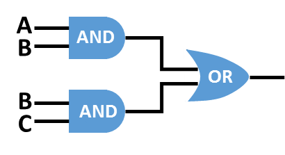
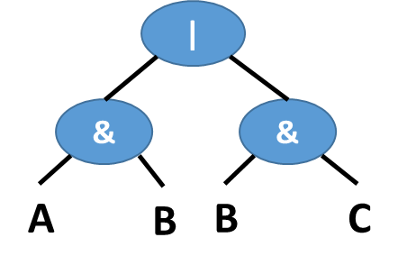
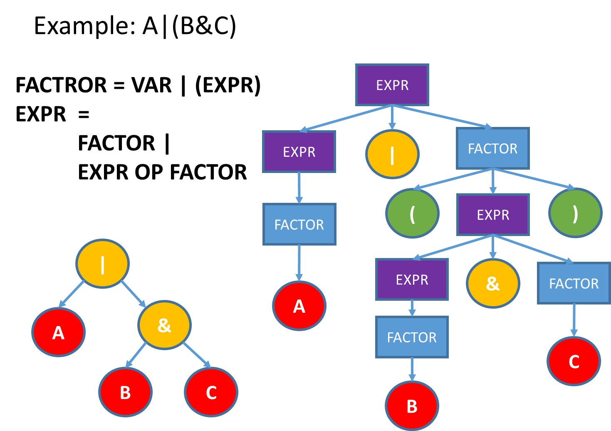

# 分析 Binary Expression 以及建構 Syntax Tree

## Expression 運算

像`4*x + 5*y`這樣的的運算式 (expression)，該如何用程式來分析並且計算？首先要先把每個元素拆開來，包含了數值`4`和`5`、運算符號`*`和`+`、以及變數`x`和`y`。而這些元素如果依照數學運算的原則，應該要先算`4*x`以及`5*y`，然後再把兩個運算結果加起來。假設變數`x`的值是`1`而`y`是`2`，代入之後得到的運算結果就是`14`。

先記住這件事：每個 expression ，最終都可以得到一個數值。

即使包含變數，當變數用對應的值代入之後，最後就會算出某個值。上面的運算式，可以拆解成三個運算式：兩個乘法運算和一個加法運算，其中加法運算是基於兩個乘法運算的結果。

上面出現的運算符號`*`和`+`所牽涉到的運算，都是二元運算 (binary operation)，每次運算都需要兩個運算元 (operands)。運算的時候，必須依照運算符號的優先順序，例如先加減後乘除，而且通常是從左到右依序運算。如果想要違背優先順序的運算，通常會另外使用括號來界定順序。

但是，假如我們不要把運算符號寫在中間，而是寫在最前面 (prefix notation)，像是 `* 4 x`，這樣的寫法，不需要括號，也能表達出各種可能的運算順序。以上面的運算式為例，原本的運算可以寫成
```
+ * 4 x * 5 y
```
首先看到 `+` 所以預期後面應該要有兩個可以"加"的東西，可能是數值或是變數。接下來看到`*`，是個運算符號，不是能夠拿來"加"的東西，所以還不能被當作前面`+`符號的運算元，還必須繼續看下去。再來看到`4`，然後又看到`x`，所以`*`所需的兩個運算元就具備了，就可以得到`(* 4 x)`這個運算式，這個運算式最終應該會得到某個值，所以可以拿來當作運算元，如此一來，前面的`+`所需的兩個運算元就具備了其中之一。接下來，`* 5 y`也構成了另一個運算式，因此`+`所需的第二個運算元也具備了，整個運算式就分析完成。

現在換成另一種狀況，假如我們想要的運算其實是`4 * (x + 5) * y`，如果用 prefix notation 來表達，依然不需要括號就能寫出來，只要寫成下面的形式就行了：
```
* * 4 + x 5 y
```
運算的順序會是`+ x 5`，把運算結果另外取個名字叫做`E1` 然後是`* 4 E1`，再把這個運算結果取名`E2`，然後就可以算`* E2 y`，算完就得到最後的結果，符合原本想要的`4 * (x + 5) * y`。

問題：如何寫程式分析 prefix expression？

## 用 Boolean Expression 來練習

整數運算還是稍嫌複雜，我們再更簡化一點，先從 Boolean expression 開始處理。作業的題目假設只有兩種 Boolean operation，`&`和`|`，分別計算 AND 和 OR，另外也規定只有四個 Boolean 變數，`A` `B` `C` `D`，每個變數的值只會是`0`或`1`，例如
```
| & A B & C D
```

底下是完整的範例程式碼，我們會再一一解釋每個函數的作用。
範例中有特別處理輸入資料裡面參雜的空白字元，如果假定輸入資料全部都相連不會有空白，程式碼可以再簡化一些。
```C
#include <stdio.h>
#include <string.h>
#include <stdlib.h>
#include <ctype.h>
    
#define MAXEXPR 256
char expr[MAXEXPR];
    
typedef enum {VAR_A, VAR_B, VAR_C, VAR_D, OP_AND, OP_OR, END} TokenSet;
char sym[]="ABCD&|";
    
TokenSet getNext(int reset)
{
    static int idx;
    TokenSet ret = END;
    int i;
    
    if (reset) {
        idx = 0;
        return END;
    }
    
    while (expr[idx]!='\0' && isspace(expr[idx])) idx++;
    
    if (expr[idx] == '\0') {
        return END;
    } else {
        for (i=0; (size_t)i<strlen(sym); i++) {
            if (sym[i]==expr[idx]) ret = i;
        }
        idx++;
        return ret;
    }
}
    
int evaluate(int A, int B, int C, int D)
{
    TokenSet tok;
    tok = getNext(0);
    if (tok==END) {
        tok = getNext(1);
        return evaluate(A, B, C, D);
    } else if (tok==OP_AND || tok==OP_OR) {
        int expr1, expr2;
        expr1 = evaluate(A, B, C, D);
        expr2 = evaluate(A, B, C, D);
        if (tok==OP_AND) {
            return (expr1 && expr2);
        }  else {
            return (expr1 || expr2);
        }
    } else {
        switch (tok) {
            case VAR_A: return A;
            case VAR_B: return B;
            case VAR_C: return C;
            case VAR_D: return D;
            default: return -1;
        }
    }
}
    
int main()
{
    size_t len;
    int i;
    
    fgets(expr, sizeof(expr), stdin);
    len = strlen(expr);
    if (len > 0 && expr[len-1] == '\n') {
        --len;
        expr[len] = '\0';
    }
    
    for (i=0; i<16; i++) {
        printf("%d%d%d%d: %d\n", (i&8)>>3, (i&4)>>2, (i&2)>>1, i&1,
        evaluate((i&8)>>3,(i&4)>>2,(i&2)>>1, i&1));
    }
    
    return 0;
}
```
首先，我們用`enum`和`typedef`自定了`TokenSet`。其中包含的`VAR_A`、`VAR_B`、`OP_AND`這些都是對應到整數值，`VAR_A`的值是`0`、`VAR_B`是`1`、`OP_AND`是`4`，‧‧‧ 。這樣的寫法是為了方便我們之後在做各種條件判斷的時候，不必直接用整數值，而是可以用看起來比較有意義的名稱，`VAR_A`代表變數`A`，`OP_AND`代表運算符號`&`。

再來看`main`裡面做了哪些事情。一開始是用`fgets`讀取整行輸入資料，讀取到的資料放在`expr`陣列中，`expr`陣列是`global`，全部的函數都看得到它。

[fgets 的用法](http://pubs.opengroup.org/onlinepubs/9699919799/functions/fgets.html)

之後的`for`迴圈，則是用二進位表示法，跑完`A`、`B`、`C`、`D`四個變數，`0`或`1`兩種可能的值，全部16種組合 (2的4次方)。


[位元運算複習](http://lms.nthu.edu.tw/course.php?courseID=26685&f=doc&cid=1110790)


### 函數 "getNext"

自己寫的`getNext`函數，目的是為了找到下一個非空白的字元，並且判斷出是哪個 token，然後把對應的 token 代號傳回去。
函數中的`static`變數`idx`，是用來記住目前讀取到`expr`陣列的哪個位置。

### 函數 "evaluate"

這是整個程式中最關鍵的函數。用遞迴方式來算出 prefix 表示法之下，Boolean expression 帶入變數值之後，得到的運算結果。
依照目前讀取到的 token，決定要做哪些事情。

> 1. 如果 token 是變數，就把當時的變數值傳回去。
> 2. 如果 token 是運算符號`&` 或 `|`，就先把後面應該要有的兩個運算元，分別透過遞迴算出來，然後再做對應的組合及運算。

```C
expr1 = evaluate(A, B, C, D);
expr2 = evaluate(A, B, C, D);
```

```C
if (tok==OP_AND) {
    return (expr1 && expr2);
}  else {
    return (expr1 || expr2);
}
```
上面用`&&`和`||`條件判斷來當作邏輯運算，是因為 C 的 True 通常會用整數`1`來表示， False 會用整數`0`表示，恰好符合我們想要的 boolean 運算結果。

## 處理十進位 + - * / 運算，從 prefix 轉 infix
底下是上學期教到 recusion 時，介紹過的範例。把輸入的 prefix 整數運算，轉成 infix 並且算出最後的答案。
```C
#include <stdio.h>
#include <ctype.h>

int calculate(void);

int main(void)
{
    printf("=%d\n", calculate());
    return 0;
}
    
int calculate(void)
{
    int c;
    int ans;
    int op1, op2;

    c = getchar();
    if (isspace(c)) {
        ans = calculate();
    } else if (c=='+') {
        printf("(");
        op1 = calculate();
        printf("+");
        op2 = calculate();
        printf(")");
        ans = op1 + op2;
    } else if (c=='-') {
        printf("(");
        op1 = calculate();
        printf("-");
        op2 = calculate();
        printf(")");
        ans = op1 - op2;
    } else if (c=='*') {
        printf("(");
        op1 = calculate();
        printf("*");
        op2 = calculate();
        printf(")");
        ans = op1 * op2;
    } else if (isdigit(c)) {
        ungetc(c, stdin);
        scanf("%d", &ans);
        printf("%d", ans);
    }

    return ans;

}
```
## 建立 Syntax Tree

底下的圖，是大家在邏輯設計課裡面會看到的邏輯閘。

下圖則是 syntax tree 示意圖，可以看得出結構和上面的邏輯閘圖很相似。


接下來的作業，會讓大家試著寫程式，將 infix 輸入的 Boolean expression，轉換成 syntax tree。
> 注意：我們假設輸入的 Boolean expression 不包含空白字元，讓問題單純一點，把重點放在如何分析語法。


### Left Association 
忽略`&`和`|`的符號運算優先順序，只考慮出現的位置。
Left association 的意思是，`A|B&C`要解讀成`(A|B)&C`，而不要當作`A|(B&C)`。

考慮底下的語法規則：

> EXPR = FACTOR| EXPR OP FACTOR
> FACTROR = VAR | (EXPR) 


意思是 expression `EXPR`可以有兩種，一種由`FACTOR`構成，而另一種是可以繼續遞迴展開，`EXPR OP FACTOR`。
而`FACTOR`則是定成`VAR`也就是單一變數就可以被視為是一個`FACTOR`，另外一種情況則是被左右括號框住的`EXPR`，而`EXPR`根據第一個語法，又可以再繼續展開。

李哲榮老師提供的演算法如下：
> Parsing EXPR = FACTOR| EXPR OP FACTOR
> 1. Find a factor from the end of expression
> 2. If there is an OP in front of the factor 
 	    2.1 Let factor be OP’s right child
 	    2.2 Parse the remaining expression recursively and make it OP’s left child


底下是依據上面的演算法寫成的範例，函數空缺的部分，請大家補上`???`的程式碼
```C
#include <stdio.h>
#include <string.h>
#include <stdlib.h>
#include <ctype.h>

#define MAXEXPR 256

char expr[MAXEXPR];
int pos;

typedef enum {VAR_A, VAR_B, VAR_C, VAR_D, OP_AND, OP_OR, END} TokenSet;
char sym[]="ABCD&|()";

typedef struct _Node {
    TokenSet data;
    struct _Node *left, *right;
} BTNode;

BTNode* EXPR();
BTNode* FACTOR();

/* create a node without any child.*/
BTNode* makeNode(char c){
    int i;
    BTNode *node = (BTNode*) malloc(sizeof(BTNode));
    for (i = 0; (unsigned int)i < strlen(sym); i++)
        if (c==sym[i]) node->data = i;
    node->left = NULL;
    node->right = NULL;
    return node;
}

/* clean a tree.*/
void freeTree(BTNode *root){
    if (root!=NULL) {
        freeTree(root->left);
        freeTree(root->right);
        free(root);
    }
}

/* print a tree by pre-order. */
void printPrefix(BTNode *root){
    if (root != NULL) {
        printf("%c",sym[root->data]);
        printPrefix(root->left);
        printPrefix(root->right);
    }
}

/* FACTOR = VAR | (EXPR) */
BTNode* FACTOR(){
    char c;
    BTNode *node = NULL;

    if (pos>=0) {
        c = expr[pos--];
        if (c>= 'A' && c<='D'){ // apply the rule FACTOR = VAR
            // make a new node for VAR
            ???
        } else if (c==')') {  // apply the rule FACTOR = (EXPR)
            // get the node pointer from recusive call of EXPR()
            ???
            if(expr[pos--]!= '(') {  // the left parenthesis is needed
                printf("Error: not matching parenthesis!\n");
                freeTree(node);
            }
        }
    }
    return node;
}


/* parse an infix expression and generate a syntax tree. 
   EXPR = FACTOR| EXPR OP FACTOR */
BTNode* EXPR(){
    char c;
    BTNode *node = NULL, *right=NULL;
    
    if (pos>=0) {   // if the expression has length > 1.
        // get the pointer to the right child from calling the function FACTOR()         
        right = ???
        if (pos>0) {
            c = expr[pos];
            if (c=='&' || c=='|'){  // apply the rule EXPR = EXPR OP FACTOR
                // make a new node for the OP
                node = ???
                // set the node's right child as ...
                node->right = ???                    
                pos--; // this step is important
                    
                // set the node's left child from recursive call of EXPR()
                node->left = ???
            } else node = right; // apply the rule EXPR = FACTOR
        } else
            node = right; // apply the rule EXPR = FACTOR
    }
    return node;
}
    
int main(void)
{
	size_t len;
    fgets(expr, sizeof(expr), stdin);
    len = strlen(expr);
    if (len > 0 && expr[len-1] == '\n') {
        --len;
        expr[len] = '\0';
    }
    pos = strlen(expr) - 1;
    BTNode *root = EXPR();
    printPrefix(root);
    freeTree(root);
    return 0;
}
```

以`A|(B&C)`為例，分析之後得到的語法示意圖如下：
