#  Computer Systems #
## computer system ##
- Hard disk(硬碟)
- Mother board(主機板)
- CPU(中央處理器)
- Register(暫存器)
- ALU(計算邏輯單元)
- Memory(記憶體)
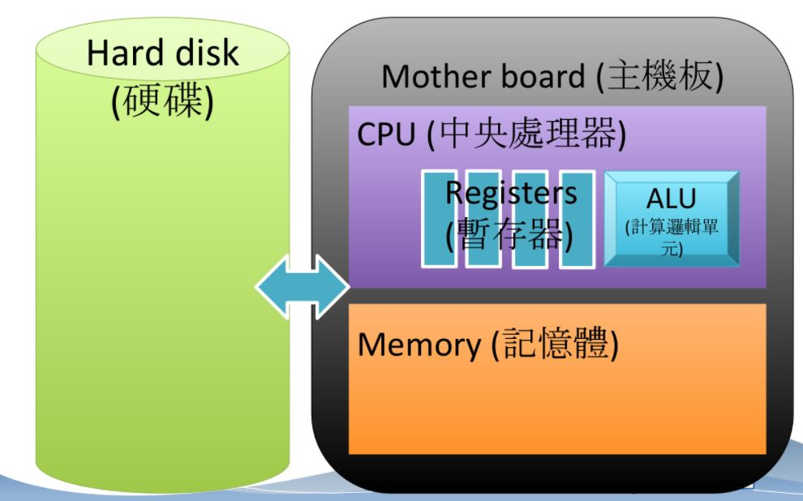
## How is a program executed? ##

## from C CODE to ASSEMBLY CODE to MACHINE CODE ##
### What is an assembly code? ###
- Consider the language translation from Chinese to English?
- 一個程式是如何被執行?(C code)  =>  如何 是 一個 程式 被執行?(Assembly code)  =>  How is a program executed?(Machine code)

### Why assembly ###
C codes (or any high level programs) are very different from the machine code
For example :
C =>
```C
#include <stdio.h>

int main(){
 printf("Hello World!");
 return 0;
}
```
assembe code =>
```
section .text
     global _start
_start:
    mov edx, len
    mov ecx, msg
    mov ebx, 1
    mov eas, 4
    int 0x80
    mov eax, 1
    int 0x80
section .data

msg db 'Hello,world!',0xa
len equ $ - msg
```
### Machine code ###
A machine code is a sequence of “instructions”.
   The basic unit of machine codes is an “instruction”.
For example :
```
 a = b
 mov [21] to r1
 mov [63] to r10
 add r1,r10,r5
 mov r5 to [D8]
```
#### Discrimination ####
| Name           | Example        | Meaning                                  |
| -------------- | -------------- | ---------------------------------------- |
| Variable       | a,b,c          | The high level naming of memory space.   |
| Value          | 1,2,3          | The value stored in the memory space.    |
| Memory address | [21],[63],[D8] | The address of memory where data are stored. |
| Register       | r1,r5,r10      | Temporary storage of data inside CPU.    |
### Instruction format ###
Instructions are encoded in binary numbers.
For example:

| 0011    | 0101    | 1010    | 0111    |
| ------- | ------- | ------- | ------- |
| op-code | operand | operand | operand |
| 3       | 5       | A       | 7       |

Op-code: Specifies which operation to execute
Operand: Gives more detailed information about the operation
### Instruction types ###
- Data Transfer
  * Copy data between CPU and memory/devices
  * E.g. LOAD,STORE,deviceI/O
- Control
  * Direct the execution of the program
  * E.g. JUMP,BRANCH,JNE(conditional jump)
- Arithmetic/Logic
  * Use existing data values to compute a new value
  * E.g. AND,OR,XOR,SHIFT,ROTATE,etc.
### Instruction execution ###
- Uses logic circuits
- Data transfer:load,store,...
  - Logic circuit for registers(Ex:flip-flops)
- Control: jump, jump-equal, …
  - Change the value of program counter (PC)
  - Comparison logic circuit
- Arithmetic/Logic: add, and, shift, …
  - Again, logic circuits
## FROM LOGIC CIRCUIT TO GATE TO SEMI-CONDUCTOR ##
### Music analogy ###
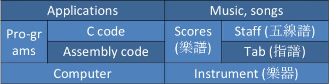

Like different kinds of instruments have different tabs;
different kinds of computers(CPUs)have different instruction
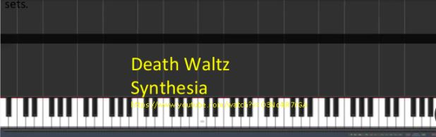

### Who plays the music? ###
A computer is more like a music box, but the songs can be “programmed”.

| Computer           | Music box           |
| ------------------ | ------------------- |
| 1/0                | Touched/not         |
| Electronic         | Mechanic            |
| Gates,circuits,... | Gears,screws,...... |

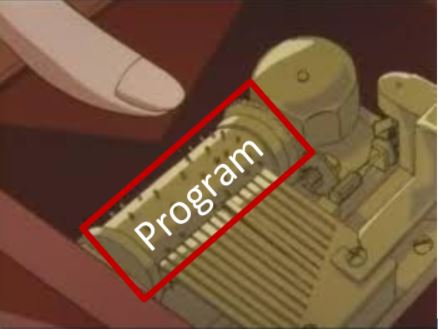
### AND Gate ###
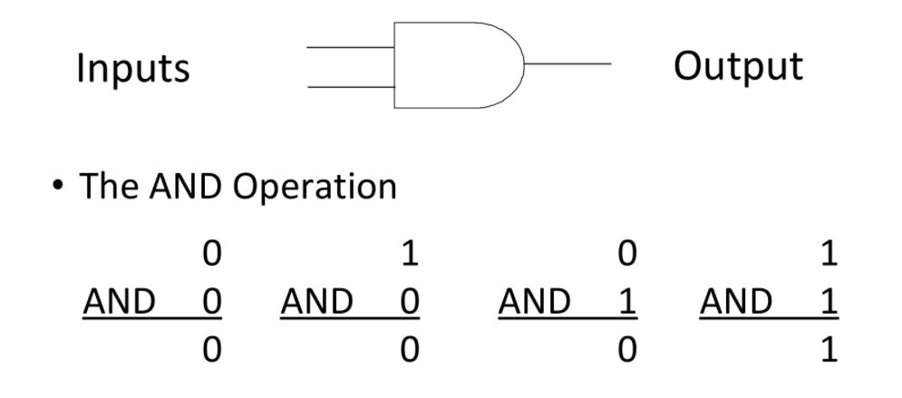
### OR Gate ###
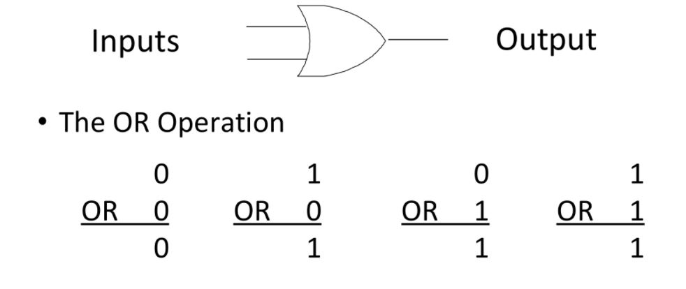
### XOR(exclusive OR) Gate ###
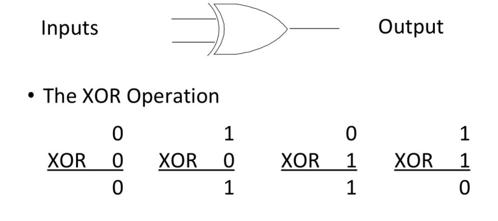
### NOT Gate ###
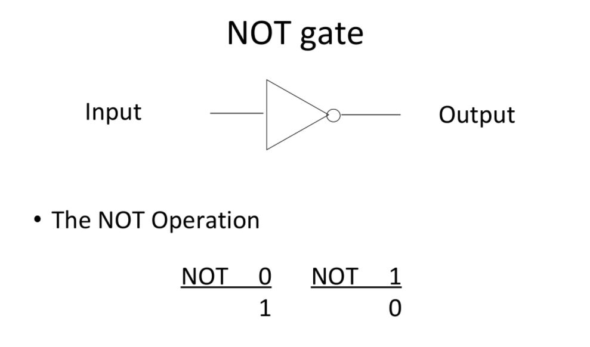
### Boolean operators ###
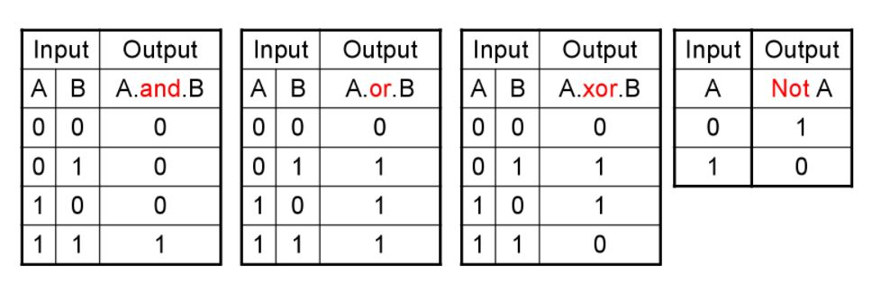
They are good for logic operations (bit operations), but how about arithmetic operations: +, -, *, /
### Boolean functions ###
- Almost all binary operations of computers can be carried out by logic gates
- Eample:One bit adder
  - Two inputs and two outputs(S:sum,C:carry out)
   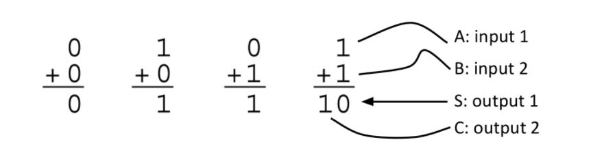
### Implementation of one bit adder ###
- The truth table of an one-bit adder
  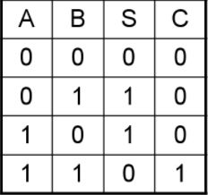
- Compare it to the truth table of Boolean function AND,OR,XOR,NOT
  - S = A.XOR.B
  - C = A.XOR.B
    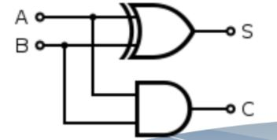
### 4 bit parallel adder ###
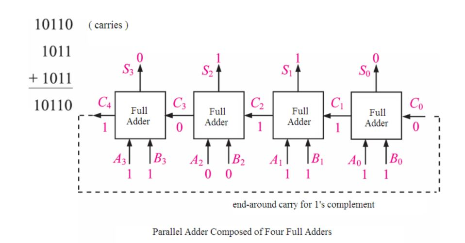
### CPU ###
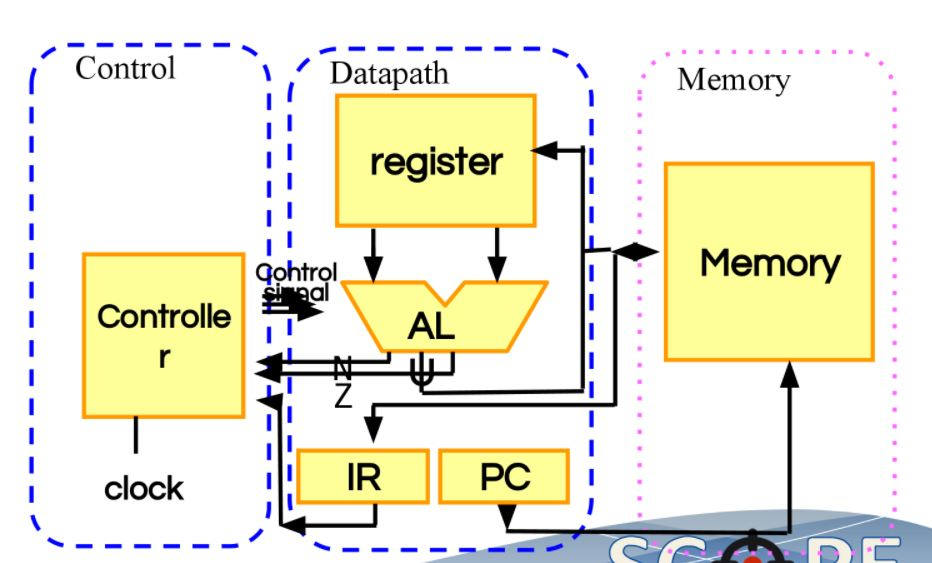
### What can be a gate? ###
- LEGO's "mechanical gates"
  - The AND gate
   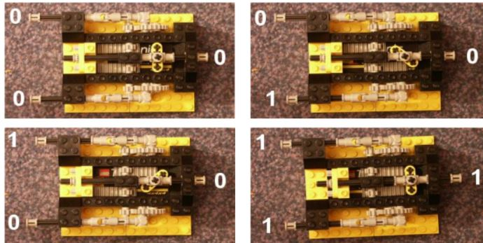 
### Ciruit gates ###
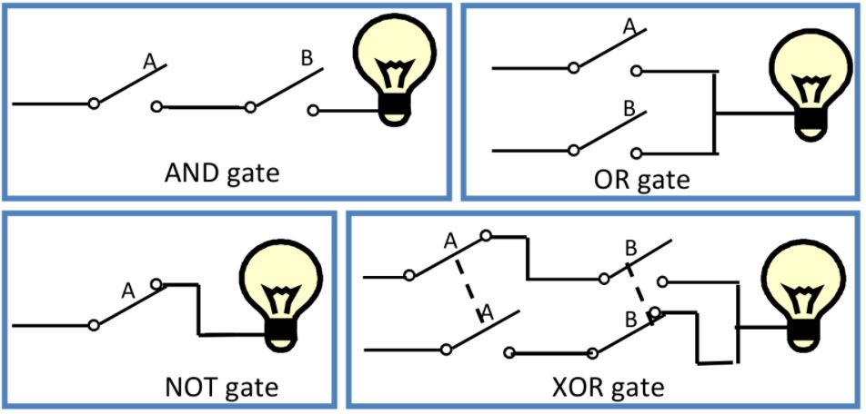
### Electronic switch ###
- The earliest one is the vacuum tube 
  - 1184,Thomas Edison
    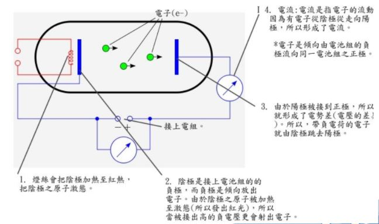
    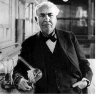
### Transistor ###
- The problem of vacuum tubes are slow, large, expensive, and easy to break
- Transistor can make it faster, smaller,and more robust.

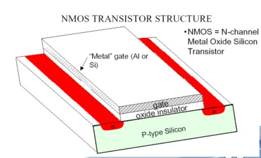
### Transistors for logic gates ###

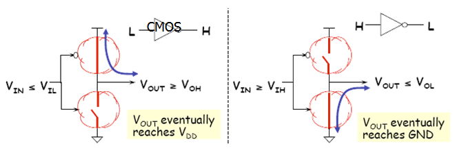
### Integrated circuit(IC) ###
- An electronic circuit consisted of transistors and other components in the thin substrate of semiconductor material.
- Also known as IC, microchip, or chip.
- Invented by Jack Kilby and Robert Noyce
  - 2000 Nobel Prize in Physics
- VLSI: Very-Large-Scale IC
  - More than million transistors
### Discrination
| Name               | Example                   | Meaning                                  |
| ------------------ | ------------------------- | ---------------------------------------- |
| Boolean,operations | AND,OR,XOR,NOT            | Math(logic)concept                       |
| Logic gate         | AND gate,OR gate,XOR gate | Physical device implementing Boolean operations |
| Bitwise operators  | &,                        | , ^, ~,>>, <<                            |
| Boolean value      | TRUE,FALSE                | Math (logic) concept                     |
| Electronic signal  | Ex: voltage               | high or low                              |
| Bit                | 0,1                       | Basic unit of data in computer system    |
