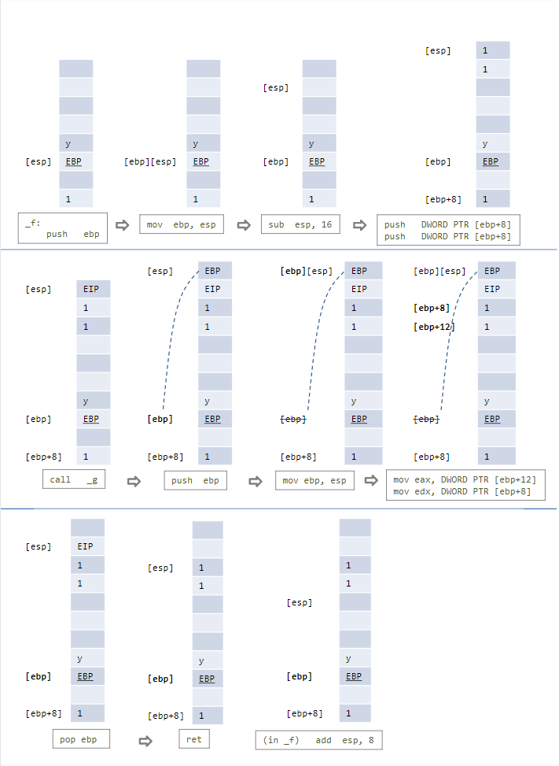

# From C to Assembly

參考資料：李哲榮老師製作的 投影片

主題：x86 組合語言 (x86 Assembly)，程式執行過程中記憶體的變化 (Stack)。

這個單元的主要任務是認識基本的組合語言指令，並且知道如何從 C 語言編譯出組合語言，再對照 C 程式和組合語言程式，了解程式的低階運作方式。
由於牽涉到的議題有點繁瑣，所以我們以李哲榮老師的投影片流程和程式範例作為主軸，透過問答的方式，來解釋相關的概念。

## 問題 1：如何把 C 程式碼轉成 x86 組合語言程式碼？
答：我們平常用來編譯 C 程式碼的工具 gcc ，裡面包含了 GNU Assembler (執行檔名稱叫做 as)，使用 gcc 編譯程式時只要加入 `–S` 參數，就可以把 `.c` 檔編譯成 `.s` 組語檔。所以最簡單的形式就是
```
 gcc –S test.c
```
另外也可以加上 `–masm=intel` 將 gcc 預設的 AT&T 語法改設為 Intel 語法，所以是
```
 gcc –S –masm=intel test.c
```
更進一步，為了讓產生的組語看起來比較簡單易懂便於講解，我們還可以關閉一些選項，免得 gcc 產生一堆額外的資訊，我們接下來的範例都會使用底下這一段命令來編譯程式碼
```
 gcc -S -masm=intel -fno-common -fno-asynchronous-unwind-tables -mno-stack-arg-probe -mpush-args -mno-accumulate-outgoing-args test.c
```
（Mac 可用 `clang -S -mllvm --x86-asm-syntax=intel -fno-common test.c` ，不過產生 code 會不一樣）

補充：
我們已經學過，從 `.c` 原始碼到執行檔，中間其實會經過許多步驟，包含前處理器 (Preprocessor) 把 `#include .h` 檔和 `#define` 這些東西先處理過，然後編譯成組合語言，接著再用組譯器 (Assembler) 把組合語言程式碼組譯成 `.o` 檔案 (Object File)，最後再用連結器 (Linker) 把多個 `.o` 檔以及程式中用到的 Library 全部連結起來，產生執行檔。當執行檔被執行的時候，執行檔內所存放的二進位機器碼會被載入到記憶體中，然後作業系統會分配運算資源，讓正在執行的程式碼可以使用電腦的資源完成任務。

## 問題 2：全域變數 (Global Variable) 轉成組語後會變成甚麼樣子？
答：用實際範例來解釋，下面的 C 程式，變數 `a` 是全域變數，
```C
int a;
int main(void)
{
    a = 3;
    return 0;
}
```
對應的組語程式碼如下。
```
1.  	.file	"assem.c"
2.  	.intel_syntax noprefix
3.      .globl	_a
4.  	.bss
5.  	.align 4
6.   _a:
7.  	.space 4
8.  	.def	___main;	.scl    2;	.type    32;	.endef
9.  	.text
10. 	.globl	_main
11. 	.def	_main;	.scl    2;	.type    32;	.endef
12.  _main:
13. 	lea	ecx, [esp+4]
14. 	and	esp, -16
15. 	push	DWORD PTR [ecx-4]
16. 	push	ebp
17. 	mov	ebp, esp
18. 	push	ecx
19. 	sub	esp, 4
20. 	call	___main
21.     mov	DWORD PTR _a, 3
22.	    mov	eax, 0
23. 	add	esp, 4
24. 	pop	ecx
25. 	pop	ebp
26. 	lea	esp, [ecx-4]
27. 	ret
```
從第 3 行開始是和全域變數 `a` 相關的資訊。組譯器 as 產生的 Object File，裡面通常包含三個 Sections，依照順序分別是 TEXT、DATA、BSS。第 4 行的 `.bss` 代表接下來進入 `.bss` Section。由於我們在宣告全域變數 `a` 的時候並沒有給它初始值，這種情況就會把變數放在 `.bss` Section，當程式開始執行的時候 `.bss` Section 會被清為 0 ，所以程式開始執行的時候 `a` 的值會是 0。我們也可以看到第 7 行 `.space` 表示 `a` 的大小為 4 Bytes。

可以自己試試看，把程式碼改成
```C
int a = 5;
int main(void)
{
    a = 3;
    return 0;
}
```
在上面的程式碼中， `a` 先設定初始值等於 5。組譯之後應該會發現 `a` 被改放在 `.data` Section，因為 “`a` 等於 5” 這項資訊必須被記錄下來，成為 Object File 的內容的一部分，不能等到程式執行時才設定。

再進一步，我們把 `int a = 5;` 改成 `int a[10000000] = {0};` 或是 `int a[10000000];` ，也就是設定一個很大的陣列，但是不初始化或只把陣列的第一個元素設定為 0。
```C
int a[10000000] = {0};
int main(void)
{
    a[0] = 3;
    return 0;
}
```
我們之前學 C 的時候知道，其餘的陣列元素也會被自動清為 0。對照組語程式碼會發現 `a` 被放在 `.bss` 未初始化的全域變數或某個函數裡面宣告為 `static` 的變數，都會被歸類到 `.bss` Section，程式開始執行時他們的值就會是 0。反之如果將陣列設定為非零的初值，使得陣列被放在 `.data` Section，最後得到的 Object File 和執行檔的大小就會變得很大，因為必須放下整個陣列，而不像 `.bss` 是到了程式開始執行載入記憶體才取得所需的陣列空間 (反正他們的值是 0，所以沒必要先記住)。


接下來要看組合語言程式碼第 21 行，對應到 C 程式的 `a = 3;` 這個句子。我們可以發現把全域變數的值改成 3 的指令是 `mov DWORD PTR _a, 3` 。其中 `mov` 的語法是 **mov destination, source**，把第二個參數搬到第一個參數，第一個參數可以是 Register 或是 Memory Address，第二個參數則可以是常數，總共有下列五種組合。

valid MOV syntax |
---------------- |
mov \<reg>, \<reg> |
mov \<reg>, \<mem> |
mov \<mem>, \<reg> |
mov \<reg>, \<const> |
mov \<mem>, \<const> |
    
## 問題 3：局部變數 (Local Variable) 轉成組語後會變成甚麼樣子？
答：局部變數只有當函數被呼叫後的執行期間會存在記憶體中，執行結束就不能再使用。局部變數所在的記憶體區塊叫做 **堆疊 (Stack)**。堆疊是從高位址往低位址的方向成長，也就是說，當堆疊的內容越疊越多，其實對應的記憶體位址越低。堆疊有兩個基本操作指令： **push** 和 **pop**，分別是將資料放入堆疊 (`push <reg>`)，以及將資料從堆疊移出 (`pop <reg>`)。

當函數被呼叫的時候，Program Counter (PC) 跳到 `.text` Section 程式碼區塊中函數所在位置開始執行函數內的指令，通常會先做的事情是把函數所需的 Stack  Frame 保留下來，用來存放局部變數。每個函數所屬的 Stack Frame ，會用 `ebp` 暫存器 (Base Pointer)，記住 Frame 的底端位址，另外還有 `esp` 暫存器 (Stack Ponter) 指向 Stack 的頂端。當我們需要用到某個局部變數，只要透過 `ebp` 再加上適當的位移，就能找到對應的局部變數。請看底下的例子。

C 程式碼：
```C
int main(void)
{
    int a;
    a = 3;
    return 0;
}
```

組合語言程式碼：
```
...省略
	sub	esp, 20
	call	___main
	mov	DWORD PTR [ebp-12], 3
	mov	eax, 0
	add	esp, 20
	pop	ecx
	pop	ebp
	lea	esp, [ecx-4]
	ret
```
其中 `[ebp-12]` 是局部變數 `a` 的位址，`mov DWORD PTR [ebp-12] , 3` 則是將 3 寫入從 `[ebp-12]` 位址 開始算起，大小為 `DWORD` (4 Bytes) 的空間中。

## 問題 4：加法運算轉成組語後會變成甚麼樣子？
答：假設有三個 `int` 局部變數 `a`, `b`, `c`。`c = a + b;` 對應的組合語言會長得像右邊這樣:
```
mov  eax, DWORD PTR [ebp-16]
mov  edx, DWORD PTR [ebp-12]
add  eax, edx
mov  DWORD PTR [ebp-20], eax
```

前面提過，`[ebp-12]`, `[ebp-16]`, `[ebp-20]` 分別對應到 `a`, `b`, `c`。將局部變數 `b` 和 `a` 的內容分別放入暫存器 `eax` 和 `edx` ，接著執行 `add eax, edx` 指令，將兩個參數所指定的暫存器中的數值相加，然後存回第一個參數指定的暫存器 (在此例為 `eax`)，最後再將 `eax` 的值搬到變數 `c` 所在的位址裡。

## 問題 5：條件判斷轉成組語後會變成甚麼樣子？
答：主要是靠 `cmp` 指令，再加上 `jle <label>` 或 `jg <label>` 。這類的 Conditional Jump 來實現 if 條件判斷。 這部分的內容，李哲榮老師的投影片已經整理得很詳細，看過之後應該都能理解。可以自己多試幾種不同的條件判斷，再對照產生的 Assembly Code，會更有感覺。要特別注意的是，由於是靠 Conditional Jump 跨過緊接在後的程式碼，而直接跳到另一個 Label 所指的程式碼區段，因此條件會和原本 if 的條件互補，例如 `if (a>3) b++;` 判斷的條件是如果 `a` 大於 3 才要接著做 `b++;`  不然就該跳過，所以要用組語指令 `jle` (小於等於) 來判斷是否要略過而直接跳到某個 Label。 
while 迴圈也是用類似的方式來實現。

## 問題 6：C 語言的指標如何用組語表達？
答：對照底下的例子。指令 `lea` 的意思是 load effective address，相當於 C 語言的符號 & 的作用。
```C
int main(void)
{
    int a;
    int *pa;
    pa = &a;
    *pa = 3;
    return 0;
}
```

上面 C 程式中第 5 行的 `pa = &a;` 對應的組合語言如下
```
lea  eax, [ebp-16]
mov  DWORD PTR [ebp-12], eax
```
上面兩行組語代表將 `[ebp-16]` 所代表的位址，記錄在自位址 `[ebp-12]` 開始，的 4 Bytes 空間中。

而下一行的 `*pa = 3;` 對應的組合語言如下
```
mov  eax, DWORD PTR [ebp-12]
mov  DWORD PTR [eax], 3
```
上面兩行組語代表先取出自位址 `[ebp-12]` 開始的 4 Bytes 空間中所儲存的資訊，將該項資訊放在暫存器 `eax` 中，接著把該項資訊當作記憶體位址來看待 (也就是 `[eax]`)，將 3 存入自 `[eax]` 位址開始的 4 Bytes 空間中。

## 問題 7：C 語言的函數呼叫如何轉成組語？
答：這個問題牽涉到 Stack，我們必須更進一步探討 Stack 在程式執行過程中如何變化。先看底下的 C 程式碼與對應的組語。我們只需要看函數 `f` 和 `g` 所屬的那一段組語程式碼。

C 程式碼：
```C
int g(int i, int j)
{
    return i+j;
}
int f(int x)
{
    int y;
    y = g(x, x) + 1;
    return y;
}
int main(void)
{
    int a;
    a = f(1);
    return 0;
}
```

組合語言程式碼：
```
_g:
    push   ebp
    mov    ebp, esp
    mov    eax, DWORD PTR [ebp+12]
    mov    edx, DWORD PTR [ebp+8]
    add    eax, edx
    pop    ebp
    ret
```
```
_f:
    push   ebp
    mov    ebp, esp
    sub    esp, 16
    push   DWORD PTR [ebp+8]
    push   DWORD PTR [ebp+8]
    call   _g
    add    esp, 8
    inc    eax
    mov    DWORD PTR [ebp-4], eax
    mov    eax, DWORD PTR [ebp-4]
    leave
    ret
```

我們可以看到，在 `f` 裡面呼叫 `g`，會跳到 `_g:` 所在的程式碼區段。進入 `g` 函數之後要做的第一件事情是 `push ebp`，用意是要把原本 `f` 的 Frame 起點記住，因為接下來 `ebp` 將會改指向 `g` 所擁有的 Frame 的起點，但是等到 `g` 結束，必須要能夠再回到 `f`，所以要設法把呼叫 `g` 之前原本的 `ebp` 記住，而記住的方式就是用 `push ebp` 把 `ebp` 的值存到 Stack 上。做完 `push ebp` 再來就是做 `mov ebp, esp`，這樣就可以把 `ebp` 設定為新的 Frame Base (目前的 Stack 的頂點)。
由於函數 `g` 沒有局部變數，因此不用調整 `esp` (不用挪出 Stack 空間給局部變數)。

接下來的兩行
```
mov    eax, DWORD PTR [ebp+12]
mov    edx, DWORD PTR [ebp+8]
```
是為了讀取從 `f` 傳入 `g` 的參數，從目前的 `ebp` 往前看 (Stack 是從高位址往低位址疊)，所以 `[ebp+8]` 和 `[ebp+12]` 其實是在目前堆疊的下方，裡面放的東西是由 `f` 呼叫 `g` 之前利用 `push` 放入的參數。函數 `g` 將兩個參數相加，把總和存放在 `eax` 暫存器，函數的回傳值，就會透過 `eax` 暫存器來傳遞，之後函數 `f` 只需要查看 `eax`，就能知道呼叫函數 `g` 所得到的計算結果。

再看一下函數 `g` 結束之前做了甚麼事:
```
pop    ebp
ret
```
所以會先把當初存入 Stack 的 `ebp` 值取回來，然後用 `ret` 跳回 `f` (關於 `ret` 稍後會再解釋)。

接下來看函數 `f` 裡面做了甚麼事情。大致和函數 `g` 相同，不過因為函數 `f` 有局部變數，所以一開始除了 `push ebp` 和 `mov ebp, esp` 之外，還要多做 `sub esp, 16` 把 `esp` 的值減去 16，也就是讓 Stack 往 “上” 長 16 Bytes，保留空間給局部變數。

接下來
```
push   DWORD PTR [ebp+8]
push   DWORD PTR [ebp+8]
```
就是將呼叫函數 `g` 所需要的參數放入堆疊 (因為是 `g(x, x)` 剛好兩個參數都相同，都在 `[ebp+8]`)。呼叫函數 `g` 的指令是 `call _g`，等到函數 `g` 結束的時候，會回到 `call _g` 的下一行，這時候先做 `add esp, 8` 把當初呼叫 `g` 時用來疊放兩個參數的 Stack 空間降回來。前面提過，呼叫 `g` 之後得到的結果是放在 `eax`，所以接下來會從 `eax` 取出結果做後續的計算。

再來我們來細看 `call`、`ret`、和 `leave` 三個指令。
1. 指令 `call` 做了兩件事: `push eip` 然後 `jmp <func addr>`。先把 Program Counter 存起來 (存在 Stack 上)，這樣之後才能回到原本執行的程式碼所在位置，存好之後就用 jmp 跳到要呼叫的函數的程式碼位址。
2. 指令 `ret` 做的事情和 `call` 互補: 先 `pop eip` 再 `jmp eip`。也就是先把舊的 Program Counter 從堆疊上取回來，然後跳回當時的程式碼位址。
3. 指令 `leave` 則是做 `mov esp, ebp` 然後 `pop ebp`，用來將 Stack Frame 還原到呼叫函數之前的狀態。

我們模擬函數 `f` 和函數 `g` 的執行過程，把 Stack  Frame 的變化畫出來。



## 問題 8: 呃 … 遞迴 …？
答：請看下面的例子，不難發現，其實遞迴就是用 `call _f` 重複呼叫自己。可想而知，Stack Frame 會因此而不斷成長，如果停止條件沒寫好，可能會造成 Stack Overflow。 

C 程式碼：
```C
int f(int x)
{
    if (x>0) return x+f(x-1);
    else return 0;
}
int main(void)
{
    int a;
    a = f(3);
=======
```C
int main(void)
{
    int a;
    int *pa;
    pa = &a;
    *pa = 3;
    return 0;
}
```


組合語言程式碼：
```
_f:
    push	ebp
    mov	ebp, esp
    sub	esp, 8
    cmp	DWORD PTR [ebp+8], 0
    jle	L2
    mov	eax, DWORD PTR [ebp+8]
    dec	eax
    sub	esp, 12
    push	eax
    call	_f
    add	esp, 16
    add	eax, DWORD PTR [ebp+8]
    jmp	L3
    L2:
    mov	eax, 0
L3:
    leave
    ret
```

我們可以做一個額外的測試，編譯的時候多加 –O2 的參數，意思是編譯的時候要做最佳化：
```
gcc -S -masm=intel -fno-common -fno-asynchronous-unwind-tables -mno-stack-arg-probe -mpush-args -mno-accumulate-outgoing-args –O2 test.c
```
得到的組語程式碼如下。看起來像是迴圈！
```
_f:
    mov	edx, DWORD PTR [esp+4]
    xor	eax, eax
    test	edx, edx
    jle	L4
    .p2align 2,,3
L3:
    add	eax, edx
    dec	edx
    jne	L3
    ret
L4:
    ret
```

確實如此，因為 `–O2` 最佳化做了 Tail Call Elimination。如此一來，只需使用同一塊 Stack Frame，用迴圈就可以達到原本遞迴呼叫的效果。如果是自己手動改寫 Tail  Recursion 版本，會長得像底下的程式碼，也就是遞迴呼叫之後，不再做任何計算，直接 return。 對比原來和新的寫法的差異 `return x+f(x-1);`  與 `return f(x-1, ans+x);` 原本呼叫 `f` 結束之後還要再多作加法才 return。改寫過的 Tail Recursion 版本的 C 程式用 `gcc –O2` 編譯，得到的組語和上面的原版結果只差一行。可見 gcc 對遞迴的最佳化能力頗強。

C 程式碼：
```C
=======
上面 C 程式中第 5 行的 `pa = &a;` 對應的組合語言如下
```
lea  eax, [ebp-16]
mov  DWORD PTR [ebp-12], eax
```
上面兩行組語代表將 `[ebp-16]` 所代表的位址，記錄在自位址 `[ebp-12]` 開始，的 4 Bytes 空間中。

而下一行的 `*pa = 3;` 對應的組合語言如下
```
mov  eax, DWORD PTR [ebp-12]
mov  DWORD PTR [eax], 3
```
上面兩行組語代表先取出自位址 `[ebp-12]` 開始的 4 Bytes 空間中所儲存的資訊，將該項資訊放在暫存器 `eax` 中，接著把該項資訊當作記憶體位址來看待 (也就是 `[eax]`)，將 3 存入自 `[eax]` 位址開始的 4 Bytes 空間中。

## 問題 7：C 語言的函數呼叫如何轉成組語？
答：這個問題牽涉到 Stack，我們必須更進一步探討 Stack 在程式執行過程中如何變化。先看底下的 C 程式碼與對應的組語。我們只需要看函數 `f` 和 `g` 所屬的那一段組語程式碼。

C 程式碼：
```C
int g(int i, int j)
{
    return i+j;
}
int f(int x)
{
    int y;
    y = g(x, x) + 1;
    return y;
}
int main(void)
{
    int a;
    a = f(1);
    return 0;
}
```

組合語言程式碼：
```
_g:
    push   ebp
    mov    ebp, esp
    mov    eax, DWORD PTR [ebp+12]
    mov    edx, DWORD PTR [ebp+8]
    add    eax, edx
    pop    ebp
    ret
```
```
_f:
    push   ebp
    mov    ebp, esp
    sub    esp, 16
    push   DWORD PTR [ebp+8]
    push   DWORD PTR [ebp+8]
    call   _g
    add    esp, 8
    inc    eax
    mov    DWORD PTR [ebp-4], eax
    mov    eax, DWORD PTR [ebp-4]
    leave
    ret
```

我們可以看到，在 `f` 裡面呼叫 `g`，會跳到 `_g:` 所在的程式碼區段。進入 `g` 函數之後要做的第一件事情是 `push ebp`，用意是要把原本 `f` 的 Frame 起點記住，因為接下來 `ebp` 將會改指向 `g` 所擁有的 Frame 的起點，但是等到 `g` 結束，必須要能夠再回到 `f`，所以要設法把呼叫 `g` 之前原本的 `ebp` 記住，而記住的方式就是用 `push ebp` 把 `ebp` 的值存到 Stack 上。做完 `push ebp` 再來就是做 `mov ebp, esp`，這樣就可以把 `ebp` 設定為新的 Frame Base (目前的 Stack 的頂點)。
由於函數 `g` 沒有局部變數，因此不用調整 `esp` (不用挪出 Stack 空間給局部變數)。

接下來的兩行
```
mov    eax, DWORD PTR [ebp+12]
mov    edx, DWORD PTR [ebp+8]
```
是為了讀取從 `f` 傳入 `g` 的參數，從目前的 `ebp` 往前看 (Stack 是從高位址往低位址疊)，所以 `[ebp+8]` 和 `[ebp+12]` 其實是在目前堆疊的下方，裡面放的東西是由 `f` 呼叫 `g` 之前利用 `push` 放入的參數。函數 `g` 將兩個參數相加，把總和存放在 `eax` 暫存器，函數的回傳值，就會透過 `eax` 暫存器來傳遞，之後函數 `f` 只需要查看 `eax`，就能知道呼叫函數 `g` 所得到的計算結果。

再看一下函數 `g` 結束之前做了甚麼事:
```
pop    ebp
ret
```
所以會先把當初存入 Stack 的 `ebp` 值取回來，然後用 `ret` 跳回 `f` (關於 `ret` 稍後會再解釋)。

接下來看函數 `f` 裡面做了甚麼事情。大致和函數 `g` 相同，不過因為函數 `f` 有局部變數，所以一開始除了 `push ebp` 和 `mov ebp, esp` 之外，還要多做 `sub esp, 16` 把 `esp` 的值減去 16，也就是讓 Stack 往 “上” 長 16 Bytes，保留空間給局部變數。

接下來
```
push   DWORD PTR [ebp+8]
push   DWORD PTR [ebp+8]
```
就是將呼叫函數 `g` 所需要的參數放入堆疊 (因為是 `g(x, x)` 剛好兩個參數都相同，都在 `[ebp+8]`)。呼叫函數 `g` 的指令是 `call _g`，等到函數 `g` 結束的時候，會回到 `call _g` 的下一行，這時候先做 `add esp, 8` 把當初呼叫 `g` 時用來疊放兩個參數的 Stack 空間降回來。前面提過，呼叫 `g` 之後得到的結果是放在 `eax`，所以接下來會從 `eax` 取出結果做後續的計算。

再來我們來細看 `call`、`ret`、和 `leave` 三個指令。
1. 指令 `call` 做了兩件事: `push eip` 然後 `jmp <func addr>`。先把 Program Counter 存起來 (存在 Stack 上)，這樣之後才能回到原本執行的程式碼所在位置，存好之後就用 jmp 跳到要呼叫的函數的程式碼位址。
2. 指令 `ret` 做的事情和 `call` 互補: 先 `pop eip` 再 `jmp eip`。也就是先把舊的 Program Counter 從堆疊上取回來，然後跳回當時的程式碼位址。
3. 指令 `leave` 則是做 `mov esp, ebp` 然後 `pop ebp`，用來將 Stack Frame 還原到呼叫函數之前的狀態。

我們模擬函數 `f` 和函數 `g` 的執行過程，把 Stack  Frame 的變化畫出來。


## 問題 8: 呃 … 遞迴 …？
答：請看下面的例子，不難發現，其實遞迴就是用 `call _f` 重複呼叫自己。可想而知，Stack Frame 會因此而不斷成長，如果停止條件沒寫好，可能會造成 Stack Overflow。 

C 程式碼：
```C
int f(int x)
{
    if (x>0) return x+f(x-1);
    else return 0;
}
int main(void)
{
    int a;
    a = f(3);
    return 0;
}
```

組合語言程式碼：
```
_f:
    push	ebp
    mov	ebp, esp
    sub	esp, 8
    cmp	DWORD PTR [ebp+8], 0
    jle	L2
    mov	eax, DWORD PTR [ebp+8]
    dec	eax
    sub	esp, 12
    push	eax
    call	_f
    add	esp, 16
    add	eax, DWORD PTR [ebp+8]
    jmp	L3
    L2:
    mov	eax, 0
L3:
    leave
    ret
```

我們可以做一個額外的測試，編譯的時候多加 –O2 的參數，意思是編譯的時候要做最佳化：
```
gcc -S -masm=intel -fno-common -fno-asynchronous-unwind-tables -mno-stack-arg-probe -mpush-args -mno-accumulate-outgoing-args –O2 test.c
```
得到的組語程式碼如下。看起來像是迴圈！
```
_f:
    mov	edx, DWORD PTR [esp+4]
    xor	eax, eax
    test	edx, edx
    jle	L4
    .p2align 2,,3
L3:
    add	eax, edx
    dec	edx
    jne	L3
    ret
L4:
    ret
```

確實如此，因為 `–O2` 最佳化做了 Tail Call Elimination。如此一來，只需使用同一塊 Stack Frame，用迴圈就可以達到原本遞迴呼叫的效果。如果是自己手動改寫 Tail  Recursion 版本，會長得像底下的程式碼，也就是遞迴呼叫之後，不再做任何計算，直接 return。 對比原來和新的寫法的差異 `return x+f(x-1);`  與 `return f(x-1, ans+x);` 原本呼叫 `f` 結束之後還要再多作加法才 return。改寫過的 Tail Recursion 版本的 C 程式用 `gcc –O2` 編譯，得到的組語和上面的原版結果只差一行。可見 gcc 對遞迴的最佳化能力頗強。

C 程式碼：
```C
/* Tail Recursion */
int f(int x, int ans)
{
    if (x>0) return f(x-1, ans+x);
    else return ans;
}
int main(void)
{
    int a;
    a = f(3, 0);
    return 0;
}
```
組合語言程式碼：

```
_f:
    mov	edx, DWORD PTR [esp+4]
    mov	eax, DWORD PTR [esp+8]
    test	edx, edx
    jle	L2
    .p2align 2,,3
L4:
    add	eax, edx
    dec	edx
    jne	L4
L2:
    ret
```

