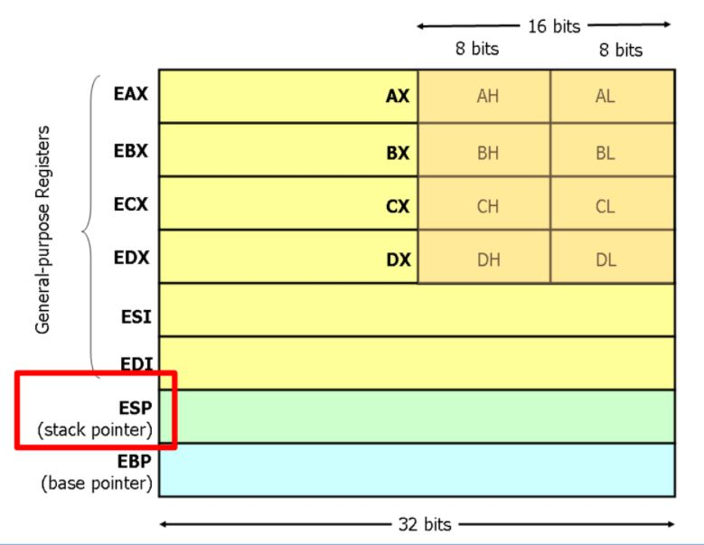
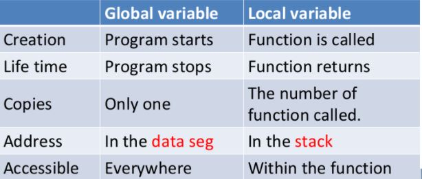
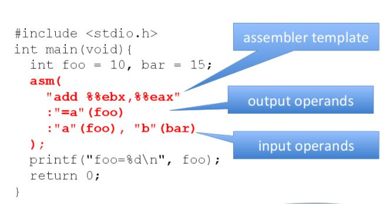
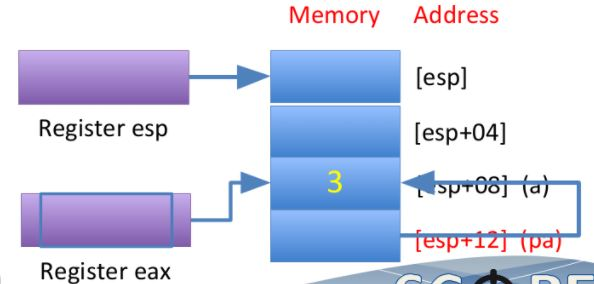
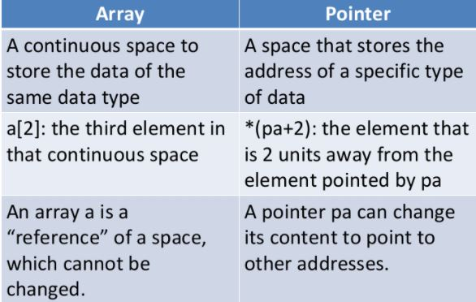
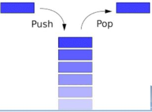
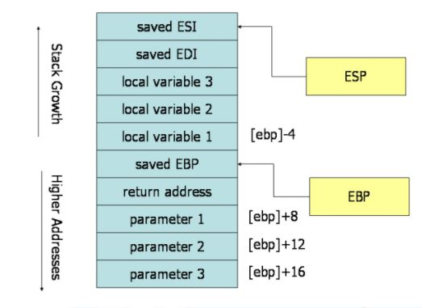

# Assembly #
## Outline ##
- How to get assembly code?
- From C to assembly code
- gcc inline assembly
- Option: advanced syntaxes in assembly
  * Pointers
  * Arrays
  * Function calls
## HOW TO GET ASSEMBLY CODE? ##
### What is assembly? ###
C codes (or any high level programs) are very different from the machine code
- C code 
```C
 #include<stdio.h>
 
 int main(){
     printf("Hello World");
     return 0;
 }
```
- Assembly code
```
  section .text
      global _start
  _start:
    mov edx, len
    mov ecx, msg
    mov ebx, 1
    mov eax, 4
    int 0x80
    mov eax, 1
    int 0x80
  section .data
  
  msg db 'Hello, world!',0xa
  len equ $ - msg    
```
### How to get the assembly code? ###
- In the terminal, use gcc -S ex1.c to get the assembly code of ex1.c 
- In today’s lecture, we use x86 CPU and intel style’s assembly
  * gcc -S -masm=intel ex1.c
- To generate executable, you can compile the assembly code directly
  * gcc ex1.s
## FROM C TO ASSEMBLY CODE ##
### Example 1: assignment 1 ###
- C code
```C
  int a;
  int main(void){
      a = 3;
  }
```
- Assembly code
```C
   mov DWORD PTR _a, 3 
```
### MOV instruction ###
- MOV is an instruction in x86’s architecture
```
MOV destination, source
```
- In example 1, destination is a memory address, named _a, and source is a constant value (3).
- DWORD specifies the data size.

|Type Specifier|Bytes addressed|
|-----------|-------------|
|BYTE|1|
|WORD|2|
|DWORD|4|
|QWORD|8|
### Example 2: assignment 2 ###
- C code
 ```C
 int main(void){
    int a;
    a = 3;
 }
 ```
- Assembly code
```
mov DWORD PTR [esp+12], 3
```
What’s differences between ex1 and ex2?
### Registers in x86 CPU ###

### Indirect memory access ###
- Register esp holds an address of memory.
- [esp+12] is a memory address, whose cell is 12 bytes below the memory cell addressed [esp].
### Analogy of seat arrangement ###
- Number all seats from 0, 4, 8, …
- Write a number on the blackboard as the content of esp.
- Ask where is [esp+12], and put 3 to that seat.
- Change the number of esp, and ask again.
### Global variable vs. local variable ###
Variable a in example 1 is a global variable,and in example 2 is a local variable.

### Example 3: assignment 3 ###
- C code
```C
int main(void){
  int a, b;
  b = a;
}
```
- Assembly code
```C
mov eax, DWORD PTR [esp+12]
mov DWORD PTR [esp+8], eax
```
### Syntax of MOV ###
```
MOV destination, source
```
- In the syntax of MOV, none of them are destination=mem and source=mem
  *  Why?
- mem can be a direct address or an indirect address
- A single b=a needs 2 instructions.
```
Valid MOV syntax
mov <reg>,<reg>
mov <reg>,<mem>
mov <mem>,<reg>
mov <reg>,<const>
mov <mem>,<const>    
```
### Example 4: Add ###
- C code
```C
 int main(void){
 int a,b,c;
 c = a + b;
 }
```
- Assembly code
```
mov eax, DWORD PTR [esp+8]
mov edx, DWORD PTR [esp+12]
add eax, edx
mov DWORD PTR [esp+4], eax
```
### ADD instruction ###
- The add instruction adds together its two operands, storing the result in its first operand.
- Ex: add BYTE PTR [var], 10 
   * add 10 to the single byte stored at memory address var
- Ex: add eax, 10
   * EAX ← EAX + 10
```
Valid add syntax
add <reg>,<reg>
add <reg>,<mem>
add <mem>,<reg>
add <reg>,<con>
add <mem>,<con>
```
### Example 5: If-else ###
- C code
```C
int main(void){
int a, b;
if (a>3)
b++;
}
```
- Assembly code
```
cmp DWORD PTR [esp+12], 3
jle L3
add DWORD PTR [esp+8], 1
L3:
  leave
```
### Cmp and jle instructions ###
- cmp compares the values of the two specified operands, setting the condition codes in the machine status word.
  * Machine status word is another register in x86 CPU
- jle label jumps to the label if the machine status word shows “less than or equal to”
### Conditional jump ###
- je <label> (jump when equal)
- jne <label> (jump when not equal)
- jz <label> (jump when last result was zero)
- jg <label> (jump when greater than)
- jge <label> (jump when greater than or equal to)
- jl <label> (jump when less than)
- jle <label> (jump when less than or equal to)
### Instruction pointer (IP) ###
- The program (a list of instructions) is stored in memory.
- Which instruction to be executed is specified by a special register, called instruction pointer.
   * In some place, it is called “program counter” (PC).
- Normally, IP increases 4 bytes (an instruction).But for jump <label>, it will become the address of the instruction after the label.
- <label> represents a memory address.
### Example 6: while loop ###
- C code
```C
int main(void){
int a, b;
while(a<=3) b++;
}
```
- Assembly code
```C
   jmp L2
L3:
   add DWORD PTR [esp+12], 1
L2:
   cmp DWORD PTR [esp+8], 3
   jle L3
   leave
```
### jmp instruction ###
- jmp <label> transfers program control flow to the instruction at the memory location indicated by the operand (<label>).
- Instruction jmp is called “unconditional jump”
### Different implementation ###
The implementation is not unique.
```C
int main(void){
int a, b;
while(a<=3) b++;
}
```
```C
L3:
  cmp DWORD PTR [esp+8], 3
  jg L2
  add DWORD PTR [esp+12], 1
    jmp L3
L2:
  leave
```
## GCC INLINE ASSEMBLY ##
### Combine C and assembly　###
- Sometime we need to combine C and assembly code
    * To improve the performance
    * To write the code for low level device drivers
- How to combine C and assembly is compiler dependent, not a standard.
   * We will use gcc’s inline assembly to introduce the idea.
### Basic structure of inline assembly ###
- Basic structure
```
asm(
   assembler template //組合語言程式
   : output operands  //輸出參數列表
   : input iperands   // 輸入參數列表
   : list of clobbered registers
);                    //被更改的暫存器列表
```
### Example 7: inline assembly ###

## ADVANCED SYNTAXES IN ASSEMBLY ##
### Example 8: pointer ###
- C code 
```C
int main(void){
int a;
int *pa;
pa = &a;
}
```
- Assembly code
```C
lea eax, [esp+8]
mov DWORD PTR [esp+12], eax
```
### lea instruction ###
- The lea (Load effective address) instruction places the address specified by its second operand into the register specified by its first operand.
  * Note, the contents of the memory location are not loaded, only the effective address is computed and placed into the register.
  * This is useful for obtaining a pointer into a memory region.
### Example 9: pointer 2 ###
- C code 
```C
int main(void){
int a;
int *pa;
pa = &a;
*pa = 3;
}
```
- Assembly code
```C
lea eax, [esp+8]
mov DWORD PTR [esp+12], eax
mov eax, DWORD PTR [esp+12]
mov DWORD PTR [eax], 3
lea eax, [esp+8]
mov DWORD PTR [esp+12], eax
mov eax, DWORD PTR [esp+12]
mov DWORD PTR [eax], 3
```

### Example 10: array ###
- C code 
```C
int main(void){
int a[3];
a[0] = 2;
a[1] = -6;
a[2] = 10000;
```
- Assembly code
```C
mov DWORD PTR [esp+4], 2
mov DWORD PTR [esp+8], -6
mov DWORD PTR [esp+12], 10000
```
### Array and pointer ###

### Example 11: function call ###
- C code 
```C
int foo(int a){
return a+1;
}
int main(void){
foo(3);
}
```
- Assembly code
```C
mov DWORD PTR [esp], 3
call _foo
```
### C language calling convention ###
- The calling convention is a protocol about how to call and return from functions.
- Two instructions for function call and return
  * Call: push the current code location onto the hardware supported stack; unconditional jump to the code location indicated by the label operand.
  * Ret: pop the current code location from the hardware supported stack; unconditional jump to the popped code location.
### Stack ###
- A stack is a data structure that has two operations: push and pop
  * push adds an element to the collection;
  * pop removes the last element that was added.
- Elements are only allowed to be added and removed from the “top” of a stack
    * First come last out

### Hardware supported stack ###
- x86 CPU has a hardware support stack
    * Two instructions: push and pop
    * Register esp (stack pointer): point to the stack top
    * Register ebp (base pointer): point to the stack base
- Used for function calls
    * Subroutine parameters are passed on the stack.
    * Registers are saved on the stack, and
    * local variables used by subroutines are placed in memory on the stack.
### The flow of a function call ###
- Caller: the one makes the function call
- Callee: the called function
### Caller rules to call function ###
1. Before calling a function, push the contents of certain registers to the stack.
   - The caller-saved registers are EAX, ECX, EDX.
2. To pass parameters to the subroutine, push them onto the stack before the call.
3. To call the function, use the call instruction.
    - Instruction call pushes the return address on top of the parameters on the stack, and jumps to the function code.
### Callee rules to start a function ###
1. Push the value of EBP onto the stack, and copy the value of ESP into EBP
2. Allocate local variables by making space on the stack.
3. Push the values of the callee-saved registers that will be used by the function.
    - The callee-saved registers are EBX, EDI, and ESI
### Function call memory layout ###

### Callee rules to return ###
1. Leave the return value in EAX.
2. Restore the old values of any callee-saved registers (EDI and ESI) that were modified.
3. Deallocate local variables.
4. Before returning, restore the caller's base pointer value by popping EBP off the stack.
5. Return to the caller by executing a ret instruction.
### Caller rules to restore ###
- Find the return value of function in the register EAX.
- Remove the parameters from stack.
- This restores the stack to its state before the call was performed.
- Pop off the contents of caller-saved registers(EAX, ECX, EDX) from the stack.
   - The caller can assume that no other registers were modified by the callee.
## References ##
http://www.cs.virginia.edu/~evans/cs216/guides/x86.html
http://www.nasm.us/pub/nasm/releasebuilds/2.09.02/win32/nasm-2.09.02-win32.zip
http://eli.thegreenplace.net/2011/02/04/where-the-top-of-the-stack-is-on-x86/
http://www.ibiblio.org/gferg/ldp/GCC-Inline-Assembly-HOWTO.html
http://ccckmit.wikidot.com/as:inlinec
陳鍾誠 (2010年10月11日)，(網頁標題) 組合語言 — 在 C 語言當中內嵌組合語言，(網站標題) 陳鍾誠的網站，取自
http://ccckmit.wikidot.com/as:inlinec ，網頁修改第0版
